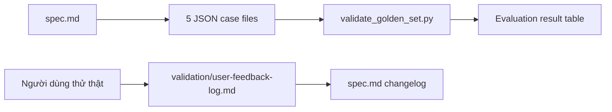

# SPIDERMAN Lab Guide - Kế hoạch triển khai

## Phase 0: Làm rõ đầu vào

- Repo hiện có; phạm vi thay đổi là nhiều artifact Markdown/JSON/Python.
- Không xây xác thực đăng nhập. `validation/` là nơi lưu feedback log từ người dùng thử.
- User đã duyệt: năm file golden cases, mỗi file bốn case; URL repository là trường tùy chọn, không bịa URL.

## Phase 1: Phân tích yêu cầu

### EARS

- WHEN kiểm tra golden set THEN validator SHALL yêu cầu đúng năm JSON file, mỗi file bốn case, tổng hai mươi case và ID duy nhất.
- WHEN một case có repository URL THEN validator SHALL chấp nhận URL `https://` hợp lệ hoặc giá trị `null`.
- WHEN chưa có user test thực tế THEN feedback log SHALL không chứa quote, tên người dùng hoặc kết quả được ngụy tạo.
- WHEN nộp spec THEN spec SHALL nêu quality bar bằng số, taxonomy bốn lớp lỗi, hai mươi case và quy trình ghi nhận kết quả.

### Ràng buộc

- Chỉ trích dẫn ngắn mã hội thoại đã ẩn danh; không sao chép data pack vào artifact.
- Không sửa source ứng dụng, README hoặc các skill hiện có.
- JSON dùng key duy nhất để tương thích parser.

## Phase 2: Đặc tả

### Luồng dữ liệu

### So sánh lựa chọn

| Lựa chọn | Ưu | Nhược | Độ phức tạp | Bảo mật | Khuyến nghị |
|---|---|---|---|---|---|
| 5 JSON + validator nhỏ | Khớp yêu cầu, dễ review | Nhiều file | Thấp | Thấp | ✓ |
| 1 JSON gồm 20 case | Ít file | Không khớp yêu cầu | Thấp | Thấp | ✗ |
| Feedback giả | Có vẻ đầy đủ | Vi phạm rubric/trung thực | Thấp | Cao | ✗ |

### Edge cases

| Edge case | Điều kiện kích hoạt | Hành vi kỳ vọng | Ảnh hưởng nếu bỏ qua |
|---|---|---|---|
| Thiếu file case | Không đủ 5 JSON | Validator fail, nêu tên file | Golden set không đủ |
| Sai số case | File không có 4 case | Validator fail | Không đủ coverage |
| ID trùng | ID xuất hiện nhiều lần | Validator fail | Kết quả không truy vết được |
| URL giả/sai | URL không phải HTTPS | Validator fail | Evidence không kiểm được |
| Feedback chưa thu thập | Chưa có phiên test thật | Template giữ trống | Tránh bịa dữ liệu |

### Xử lý ngoại lệ

| Loại ngoại lệ | Nguồn | Cách xử lý | Phục hồi |
|---|---|---|---|
| JSON không parse được | File eval | In lỗi và exit 1 | Sửa JSON theo lỗi báo |
| Schema thiếu field | Case eval | In path/field thiếu và exit 1 | Bổ sung field |
| URL không hợp lệ | `repository_url` | In ID case và exit 1 | Dùng HTTPS hoặc `null` |

Không có shared state hoặc truy cập đồng thời; không cần chiến lược locking hay idempotency ngoài việc validator chỉ đọc file.

## Phase 3: Kế hoạch triển khai

### Root task: Add Feature: Lab evaluation artifacts

1. Task: Hoàn thiện AI spec
   - Goal: Ghi thiết kế, test plan và validation plan kiểm chứng được.
   - Files: `spec.md`
   - Minimal change: Thay scaffold bằng nội dung Lab Guide có evidence và trạng thái trung thực.
   - Verify command: `python eval/validate_golden_set.py`
   - Expected output: `VALIDATION PASSED`.
2. Task: Tạo golden set phân loại
   - Goal: Cung cấp năm JSON, mỗi file bốn case phủ taxonomy.
   - Files: `eval/01_happy_path.json`, `eval/02_missing_information.json`, `eval/03_source_of_truth.json`, `eval/04_out_of_scope.json`, `eval/05_domain_edge_cases.json`
   - Minimal change: Tạo đúng 20 object theo schema tối giản.
   - Verify command: `python eval/validate_golden_set.py`
   - Expected output: `VALIDATION PASSED`.
3. Task: Thêm kiểm tra golden set
   - Goal: Phát hiện cấu trúc JSON không đúng trước khi chấm.
   - Files: `eval/validate_golden_set.py`
   - Minimal change: Standard-library Python, chỉ đọc file.
   - Verify command: `python eval/validate_golden_set.py`
   - Expected output: Báo 5 file, 20 case, PASS.
4. Task: Tạo feedback-log trung thực
   - Goal: Chuẩn bị ghi ≥5 phiên user test thật.
   - Files: `validation/user-feedback-log.md`
   - Minimal change: Template và checklist, không có feedback giả.
   - Verify command: `rg -n "Feedback giả|TODO|TBD" validation/user-feedback-log.md`
   - Expected output: Không có placeholder cấm hay claim đã test.

### Kiểm tra cuối

- [x] Deliverable được lập kế hoạch đầy đủ.
- [x] Có validation tự động và review nội dung.
- [x] Mỗi task truy vết tới EARS.
- [x] Không thêm abstraction, dependency hoặc config không cần thiết.
