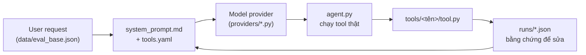

# Lab 04 — Research Agent Tool Eval

**Prompt Engineering · Day 4 · ~205 phút · VinUni AI Codelab × GDGoC · Cập nhật 2026-07-31**

> **205 phút · Day 4 · intermediate.** Nhóm bạn nhận một research agent đã chạy được nhưng
> [system prompt](#glossary "Đoạn chỉ dẫn đặt ở đầu hội thoại, nói cho model biết nó là ai và được phép làm gì.")
> và
> [tool declaration](#glossary "Phần khai tên, mô tả và schema tham số của từng tool, gửi kèm mỗi request để model biết nó có công cụ nào.")
> đang viết rất mơ hồ. Bạn chạy bộ eval 20 case, đọc log JSON để biết agent chọn sai tool ở đâu,
> sửa hai file artifact qua ba vòng, và nộp report dựa trên số đo thật. Step 1 chạy được mà chưa cần API key.

Câu hỏi trọng tâm xuyên suốt Lab:

> **Khi agent chọn sai tool, lỗi nằm ở system prompt hay ở mô tả tool — và bạn lấy bằng chứng nào từ log để phân biệt hai chỗ đó?**

> **Mâu thuẫn trong repo — cách guide này xử lý**
>
> - `README.md` mục "Checkpoints" ghi buổi chiều 14:00–18:00 tức 240 phút, nhưng trong đó có 15 phút nghỉ và 20 phút Kahoot. Guide dùng `duration: 205` = tổng 6 step làm việc.
> - `README.md` gộp bốn việc vào mốc "Baseline v0 — 14:40–15:15" (35 phút), gồm cả dựng UI local. Guide tách UI làm hai nửa: khung tối thiểu ở step 2, hiện tool trace và link công khai ở step 4.
> - `README.md` mục "Step 4 — Add team eval" nhắc thư mục `solution/`. Thư mục này không có trong repo student. Guide chỉ dùng `starter_v0/samples/eval_group.schema.example.json`.
> - `README.md` mục Scope yêu cầu "ít nhất 5 tool trong `artifacts/tools.yaml`", nhưng file đó đã khai sẵn 10 tool. Điều kiện này đã đạt từ đầu; việc thật sự phải làm là viết ít nhất 1 tool mới.
> - `artifacts/tools.yaml` đặt nhãn `# ---------------- Bonus tools ----------------` cho `send`, `policy`, `papers`, `paper_text`; `README.md` nói bốn tool này không tính là bonus. Guide theo `README.md`: chúng là optional built-in.
> - UI là deliverable core theo `README.md`, nhưng repo không có `app.py` và `requirements.txt` không có `streamlit`. Guide đánh dấu `app.py` là FILE MỚI và yêu cầu tự thêm dependency ở step 2.
> - Repo không có test tự động: không có thư mục `tests/`, không có pytest config. `run_eval.py` là bộ chấm nhưng cần API key. Step 1 dùng validation read-only chạy offline thay thế.
> - `data/eval_group.json` để trống có chủ đích. Chạy `run_eval.py` với file này báo `No cases matched phase='B'` cho tới khi nhóm viết case.
> - Repo không khai phiên bản Python ở đâu cả. Guide chọn Python 3.10+ làm mức sàn (Coach inference) vì code dùng cú pháp annotation `str | None`.

Ba lớp của hệ thống bạn sẽ sửa. Chỉ hai file ở lớp giữa được phép đổi trong mỗi vòng cải tiến:



| Thành phần | Vai trò | File phụ trách |
|:---|:---|:---|
| Bộ case cố định | 20 case chấm routing và args, không được sửa | `data/eval_base.json` |
| Bộ case của nhóm | 10 case nhóm tự thiết kế | `data/eval_group.json` (Role 1) |
| Tool mới | Implementation + tài liệu + đăng ký | `tools/<tên_tool>/` (Role 2) |
| Chỉ dẫn cho model | System prompt và mô tả tool | `artifacts/system_prompt.md`, `artifacts/tools.yaml` (Role 3) |
| UI demo | Entrypoint cho người ngoài thử agent | `app.py` — FILE MỚI (Role 4) |
| Bằng chứng | Version log và report nộp bài | `artifacts/version_log.csv`, `artifacts/REPORT.md` (Role 5) |

---

## 1. Dựng môi trường và chạy registry tool khi chưa có API key (40 phút)

:::goal{title="Registry 10 tool chạy được offline, nhóm đã ký tên vào bảng phân vai"}
Bạn có một venv cài đủ dependency, ba tool local chạy ra output thật, và mỗi người trong nhóm sở hữu đúng một file.
:::

### Tại sao chưa gọi API key ngay?

Một agent gồm ba phần rời nhau: model provider, phần khai tool, và phần code tool chạy thật. Ba tool trong repo này (`clarify`, `format`, `send` ở chế độ chưa xác nhận) chạy hoàn toàn trên máy bạn. Kiểm chúng trước để nếu step 2 lỗi, bạn biết lỗi nằm ở API key chứ không nằm ở cài đặt.

**Bạn làm:**

1. Mở terminal tại thư mục gốc repo, rồi tạo venv và cài dependency trong `starter_v0/`.
2. Tạo `starter_v0/.env` từ `starter_v0/.env.example` — KHÔNG COMMIT, file này đã có trong `.gitignore` ở cả repo root và `starter_v0/`.
3. Chạy hai lệnh validation dưới đây và đối chiếu output.
4. Điền bảng phân vai, mỗi người ghi tên vào đúng một dòng.

Setup (chọn đúng tab OS của bạn):

:::os
```bash tab="macOS / Linux"
cd starter_v0
python3 -m venv .venv
source .venv/bin/activate
python -m pip install -r requirements.txt
test -f .env || cp .env.example .env
```
```powershell tab="Windows"
cd starter_v0
py -3 -m venv .venv
.\.venv\Scripts\Activate.ps1
python -m pip install -r requirements.txt
if (-not (Test-Path .env)) { Copy-Item .env.example .env }
```
:::

Validation 1 — tên tool trong `artifacts/tools.yaml` có khớp với
[registry](#glossary "Dict TOOL_FUNCTIONS trong tools/__init__.py, map tên tool mà model thấy sang hàm Python chạy thật.")
trong `tools/__init__.py` hay không. Đây là lệnh read-only, không tiêu quota API:

```bash
python -c "
from pathlib import Path
from tools import TOOL_FUNCTIONS, load_tool_declarations
declared = [d['name'] for d in load_tool_declarations(Path('artifacts/tools.yaml'))]
print('declared_in_yaml :', declared)
print('implemented      :', sorted(TOOL_FUNCTIONS))
print('yaml_not_impl    :', sorted(set(declared) - set(TOOL_FUNCTIONS)))
print('impl_not_yaml    :', sorted(set(TOOL_FUNCTIONS) - set(declared)))
"
```

Kết quả đúng:

```text
declared_in_yaml : ['clarify', 'timeline', 'social_search', 'lookup', 'fetch', 'format', 'send', 'policy', 'papers', 'paper_text']
implemented      : ['clarify', 'fetch', 'format', 'lookup', 'paper_text', 'papers', 'policy', 'send', 'social_search', 'timeline']
yaml_not_impl    : []
impl_not_yaml    : []
```

Hai dòng cuối phải rỗng. Sau này khi nhóm đổi tên tool, chạy lại đúng lệnh này là cách nhanh nhất để biết đã sync đủ chưa.

Validation 2 — ba tool chạy local, không cần key:

```bash
python -c "
from tools import TOOL_FUNCTIONS as T
print(T['clarify'](question='Bạn muốn xem tweet của ai?', response_type='text'))
print(T['send']('AI20k dry run', confirmed=False))
r = T['format'](items=[{'title':'GPT-5','url':'https://openai.com/blog/gpt-5','summary':'Ban tin thu nghiem'}], template='brief', headline='Tin AI hom nay')
print(r['markdown'])
"
```

Kết quả đúng:

```text
{'tool': 'ask_user', 'question': 'Bạn muốn xem tweet của ai?', 'response_type': 'text', 'options': [], 'awaiting_user': True}
{'tool': 'send_telegram', 'status': 'needs_confirmation', 'message': 'Only send after the user explicitly confirms.'}
**Tin AI hom nay**

- Ban tin thu nghiem - [openai.com](https://openai.com/blog/gpt-5)
```

Dòng thứ hai là
[confirmation boundary](#glossary "Ranh giới bắt agent xin xác nhận của người dùng trước khi làm hành động ghi ra ngoài, ví dụ gửi tin nhắn.")
đã có sẵn trong code: `send` với `confirmed=False` không gửi gì, chỉ trả `needs_confirmation`. Bộ eval chấm ranh giới này ở case `R12_confirm_before_send`.

### Phân vai — 1 người 1 file

Ghi tên vào cột cuối. Bảng này giả định nhóm 5 người; nhóm 4 người thì gộp Role 1 và Role 5, không bao giờ gộp Role 4.

| Role | File sở hữu | Nhiệm vụ chính | Người đảm nhận |
|:---|:---|:---|:---|
| Role 1 — Test Architect | `data/eval_group.json` | Thiết kế 10 case của nhóm | `________________` |
| Role 2 — Tool Engineer | `tools/<tên_tool_mới>/` | Viết tool mới + `TOOL.md` | `________________` |
| Role 3 — Prompt Engineer | `artifacts/system_prompt.md`, `artifacts/tools.yaml` | Sửa prompt và mô tả tool | `________________` |
| Role 4 — Integrator | `app.py`, chạy `run_eval.py` | Dựng UI, chạy mọi version | `________________` |
| Role 5 — Reporter | `artifacts/REPORT.md`, `artifacts/version_log.csv` | Ghi metric và bằng chứng | `________________` |

Một ràng buộc dễ vỡ: tool mới của Role 2 cần một declaration trong `artifacts/tools.yaml`, mà file đó thuộc Role 3. Role 2 gửi đoạn YAML cho Role 3 dán vào; chỉ Role 3 sửa file đó. Cùng lúc hai người sửa `tools.yaml` là nguồn conflict duy nhất của repo kiểu này.

**Nếu bị chậm:** làm xong Validation 1 và bảng phân vai là đủ điều kiện sang step 2. Validation 2 chạy sau cũng được.

**Xong sớm:** đọc `tools/clarify/TOOL.md` và `tools/README.md`, rồi ghi vào `artifacts/REPORT.md` mục A2 tên 6 core tool kèm một dòng mô tả mỗi tool.

:::checkpoint{title="Hoàn thành khi"}
[ ] Terminal hiện `(.venv)` ở đầu dòng lệnh
[ ] Validation 1 in ra `yaml_not_impl    : []` và `impl_not_yaml    : []`
[ ] Validation 2 in ra `'status': 'needs_confirmation'` cho `send`
[ ] `starter_v0/.env` tồn tại và `git status --short` không liệt kê nó
[ ] Cả 5 dòng trong bảng phân vai đã có tên người, không dòng nào trống
[ ] Bạn giải thích được vì sao đổi tên tool trong `tools.yaml` mà quên `tools/__init__.py` thì eval hỏng
:::

:::caution{title="Troubleshooting — Vấn đề thường gặp"}
`ModuleNotFoundError: No module named 'yaml'`
→ **Mindset**: lỗi này nói package chưa có trong Python đang chạy, chứ không nói máy bạn thiếu package. Thường là bạn quên activate venv, hoặc mở terminal mới.
→ Kiểm tra đầu dòng lệnh có `(.venv)` chưa. Chưa có thì activate lại rồi chạy `python -m pip install -r requirements.txt`.

`ModuleNotFoundError: No module named 'tools'`
→ **Mindset**: Python tìm module theo thư mục bạn đang đứng. Lỗi này là lỗi vị trí, không phải lỗi cài đặt.
→ Chạy `pwd` (Windows: `Get-Location`). Đường dẫn phải kết thúc bằng `starter_v0`. Nếu không, `cd starter_v0` rồi chạy lại.

Windows chặn script activate với `cannot be loaded because running scripts is disabled`
→ **Mindset**: đây là policy của PowerShell, không phải lỗi của repo.
→ Chạy `Set-ExecutionPolicy -Scope Process -Bypass` trong cùng cửa sổ đó rồi activate lại.
:::

---

## 2. Chạy baseline v0 và đọc một trace fail (35 phút)

:::goal{title="Có một file runs/*.json với provider_error_cases bằng 0 và bốn metric đã ghi lại"}
Bạn có số đo baseline để mọi vòng sau so vào, và bạn đã đọc được một case fail xuống tận args mà model gửi.
:::

### Tại sao chạy trước khi sửa?

`artifacts/system_prompt.md` hiện đang dạy agent những thứ ngược với bộ eval: nó nói người dùng ghét bị hỏi lại, cứ đoán bừa handle, và cứ gửi tin đi mà không xin xác nhận. Bạn không sửa nó ngay — bạn chạy trước để có con số chứng minh nó sai ở đâu.

**Bạn làm** (Role 4 chạy lệnh, Role 5 ghi số):

1. Điền key model provider vào `starter_v0/.env`, thêm `TAVILY_API_KEY`, `FIRECRAWL_API_KEY`, `RAPIDAPI_KEY` nếu nhóm có.
2. Chạy `scripts/preflight_provider.py` để xác nhận provider trả về tool call có cấu trúc.
3. Chạy `run_eval.py` với `--version v0` trên `data/eval_base.json`.
4. Mở file JSON mới trong `runs/` và ghi bốn metric vào `artifacts/REPORT.md` mục B1.
5. Dựng khung `app.py` tối thiểu — FILE MỚI, chỉ cần nhận một câu hỏi và in kết quả.

Setup check — provider có trả tool call không:

```bash
python scripts/preflight_provider.py --provider openrouter
```

Kết quả kỳ vọng (Coach inference — chưa chạy được ở đây vì cần API key; ba dòng và thứ tự lấy từ `scripts/preflight_provider.py`):

```text
OK provider=openrouter model=openai/gpt-4o-mini
tool=timeline
args={'screenname': 'sama'}
```

Automated test — bộ chấm 20 case, chạy tool thật:

```bash
python run_eval.py --provider openrouter --version v0 --suite base --eval-cases data/eval_base.json
```

Kết quả kỳ vọng (Coach inference — chưa chạy được ở đây vì cần API key; khung bảng và tên field lấy từ `print_table` và `summarize` trong `run_eval.py`, các con số accuracy sẽ khác theo model):

```text
Running R01_user_tweets_routing...
...
R01_user_tweets_routing      PASS
R10_missing_handle           FAIL  missing_info
R12_confirm_before_send      FAIL  wrong_boundary
...
total_cases: 20
measured_cases: 20
provider_error_cases: 0
passed_cases: 9
case_accuracy: 0.45
tool_routing_accuracy: 0.65
argument_accuracy: 0.5
multiturn_accuracy: 0.3333

Artifact version: v0+pf0c107a9d7a1+t011c271ef0bb

Saved: runs/v0_B_base_openrouter_20260731T144512123456.json
```

Dòng `Artifact version` không phải Coach inference: `v0+pf0c107a9d7a1+t011c271ef0bb` là giá trị thật khi `system_prompt.md` và `tools.yaml` còn nguyên như starter. Nó là
[hash](#glossary "Chuỗi sinh từ nội dung file; đổi một ký tự trong file là hash đổi hoàn toàn, nên nó chứng minh bạn chạy đúng phiên bản artifact nào.")
sha256 của hai file, cắt còn 12 ký tự — xem `versioning.py`. Nếu hai run khác nhau mà cùng hash thì bạn chưa sửa artifact nào.

Trước khi tin bất kỳ metric nào, kiểm ba điều kiện trong `README.md`: `provider_error_cases` phải bằng `0`, `measured_cases` phải bằng `total_cases`, và mọi `tool_results` có `error` phải được đọc bằng mắt. Routing PASS không chứng minh tool đã chạy xong.

:::quiz{id="q-metric-valid" answer="c"}
Run JSON của bạn có `case_accuracy: 0.60` và `provider_error_cases: 4` trên tổng 20 case. Vì sao chưa được ghi 0.60 vào report?

- a) Vì 0.60 là con số quá thấp để báo cáo
- b) Vì cần chạy lại đúng ba lần rồi lấy trung bình
- c) Vì 4 case bị lỗi provider đã bị loại khỏi mẫu, nên 0.60 là tỉ lệ trên 16 case chứ không phải trên 20
:::

Bây giờ đọc một case fail. Lệnh này chỉ đọc file JSON, không tiêu quota:

```bash
python -c "
import json, glob
run = json.load(open(sorted(glob.glob('runs/*.json'))[-1], encoding='utf-8'))
for item in run['results']:
    if not item['result']['passed']:
        print('case_id          :', item['id'])
        print('expected         :', item['expect'])
        print('actual_tool_calls:', item['result']['actual_tool_calls'])
        print('observed_mismatch:', item['result']['observed_mismatch'])
        print('failures         :', item['result']['failures'])
        break
"
```

Kết quả kỳ vọng (Coach inference — cần một file trong `runs/` nên chưa chạy được ở đây; tên các field lấy từ `evaluate_phase_b` trong `run_eval.py`):

```text
case_id          : R10_missing_handle
expected         : {'tool_calls': [{'name': 'clarify', 'args': {'response_type': 'text'}}]}
actual_tool_calls: [{'name': 'timeline', 'args': {'screenname': 'sama', 'limit': 5}}]
observed_mismatch: missing_tool_call
failures         : ['missing tool call clarify', 'extra tool call timeline']
```

`observed_mismatch` là chẩn đoán do bộ chấm sinh ra, còn `failure_type` là loại lỗi mà người viết case dự đoán trước. Hai giá trị này khác nhau là chuyện bình thường và chính chỗ lệch đó cho bạn giả thuyết.

:::input{id="v0-four-metrics" target="starter_v0/artifacts/REPORT.md#b1-version-evidence" lines="4"}
Ghi bốn metric của v0: `case_accuracy`, `tool_routing_accuracy`, `argument_accuracy`, `multiturn_accuracy`. Kèm tên file run và `artifact_version` để người khác mở lại đúng run đó.
:::

:::input{id="v0-first-failure" target="starter_v0/artifacts/REPORT.md#b2-failure-analysis" lines="4"}
Chọn một case fail. Agent đã gọi tool nào với args nào, và câu nào trong `artifacts/system_prompt.md` khiến nó làm vậy? Trích nguyên văn câu đó.
:::

<details>
<summary>Gợi ý — bấm để mở</summary>

Đọc `artifacts/system_prompt.md` cùng lúc với case fail. File đó có một câu về việc người dùng ghét bị hỏi lại và một câu về việc cứ gửi đi cho nhanh. Đối chiếu hai câu đó với `expect` của `R10_missing_handle` và `R12_confirm_before_send`.

</details>

**Bạn làm** (Role 4 — khung `app.py`, FILE MỚI):

Repo không có `app.py`. Tạo file đó trong `starter_v0/`, tái dùng `run_model_tool_loop` của `chat.py` thay vì viết một agent loop thứ hai. Khung tối thiểu 15 dòng dưới đây đã chạy được; step 4 sẽ thêm phần hiện tool trace.

```python
import streamlit as st
from pathlib import Path
from env_loader import load_lab_env
from providers import make_provider
from tools import load_tool_declarations, to_openai_tools
from chat import run_model_tool_loop

load_lab_env(Path.cwd())
prompt = Path("artifacts/system_prompt.md").read_text(encoding="utf-8")
tools = to_openai_tools(load_tool_declarations(Path("artifacts/tools.yaml")))
question = st.text_input("Bạn hỏi gì?")
if question:
    result = run_model_tool_loop(
        provider=make_provider("openrouter"),
        messages=[{"role": "system", "content": prompt}, {"role": "user", "content": question}],
        tools=tools, model=None, max_tool_rounds=4,
    )
    st.write(result["assistant_text"])
```

Thêm `streamlit>=1.30.0` vào `requirements.txt` rồi cài, sau đó chạy:

```bash
python -m pip install "streamlit>=1.30.0"
streamlit run app.py
```

Kết quả kỳ vọng (Coach inference — chưa chạy được ở đây vì cần API key và cần `app.py` do nhóm tạo):

```text
  You can now view your Streamlit app in your browser.

  Local URL: http://localhost:8501
```

**Nếu bị chậm:** chạy được `run_eval.py` với `provider_error_cases: 0` và ghi bốn metric là đủ điều kiện sang step 3. Khung `app.py` làm ở đầu step 3.

**Xong sớm:** chạy `python scripts/parse_runs.py runs/ --output analysis/base_runs.csv` để có bảng phẳng 14 cột, dễ so nhiều run cạnh nhau.

:::checkpoint{title="Hoàn thành khi"}
[ ] `python scripts/preflight_provider.py --provider openrouter` in dòng bắt đầu bằng `OK provider=`
[ ] Có đúng một file mới trong `starter_v0/runs/` và trong đó `summary.provider_error_cases` bằng `0`
[ ] Ô điền bốn metric của v0 đã có nội dung của bạn, kèm tên file run
[ ] Ô điền case fail đầu tiên đã trích nguyên văn một câu trong `artifacts/system_prompt.md`
[ ] Bạn giải thích được vì sao `tool_routing_accuracy` cao mà `case_accuracy` vẫn thấp
:::

:::caution{title="Troubleshooting — Vấn đề thường gặp"}
`RuntimeError: Missing API key env var: OPENROUTER_API_KEY`
→ **Mindset**: code đọc biến môi trường, không đọc file bạn nghĩ nó đọc. Kiểm nơi đọc trước khi kiểm giá trị.
→ File phải tên đúng `.env`, nằm trong `starter_v0/`, và dòng phải là `OPENROUTER_API_KEY=sk-...` không có khoảng trắng quanh dấu `=`. Provider khác thì đổi cả `--provider` trong lệnh cho khớp.

`SystemExit: Provider did not return structured tool_calls.`
→ **Mindset**: key đúng nhưng model không hỗ trợ tool calling, hoặc model bạn chỉ định không có tính năng đó.
→ Bỏ `--model` để dùng default `openai/gpt-4o-mini` trong `providers/openrouter_provider.py`, chạy lại preflight.

`summary.provider_error_cases` lớn hơn `0`
→ **Mindset**: những case đó bị loại khỏi mẫu đo, nên mọi accuracy trong run này là tỉ lệ trên tập nhỏ hơn. Đây không phải kết quả xấu, đây là kết quả không dùng được.
→ Đọc `results[*].result.failures` của các case đó: thường là rate limit hoặc hết quota. Chờ rồi chạy lại toàn bộ suite, đừng chạy lẻ vài case.

Nhiều case FAIL với `failures` chứa `extra tool call`
→ **Mindset**: agent gọi thêm tool ngoài danh sách kỳ vọng cũng bị tính sai, không chỉ gọi thiếu.
→ Xem `artifacts/tools.yaml` còn khai `send`, `policy`, `papers`, `paper_text` không. Bốn declaration optional này vẫn được gửi cho model và vẫn hút được request.
:::

---

## 3. Chạy vòng v1 và thêm một tool mới (35 phút)

:::goal{title="Có một metric tăng so với v0, và một tool mới do nhóm viết gọi được qua registry"}
Bạn có dòng `v1` trong `artifacts/version_log.csv` với before/after trên cùng một metric, và một tool mới đủ bốn mảnh: `TOOL.md`, `tool.py`, registry, declaration.
:::

### Tại sao chỉ sửa một thứ mỗi vòng?

Nếu bạn sửa prompt và mô tả tool cùng lúc rồi metric tăng, bạn không biết cái nào có tác dụng. Mỗi vòng là một giả thuyết và một thay đổi, để dòng before/after trong version log nói được điều gì đó.

**Bạn làm:**

1. Role 3 — chọn một case fail ở step 2, sửa đúng một chỗ trong `artifacts/system_prompt.md` **hoặc** `artifacts/tools.yaml`.
2. Role 2 — tạo `tools/<tên_tool_mới>/tool.py` và `tools/<tên_tool_mới>/TOOL.md`, thêm một dòng vào `tools/__init__.py`.
3. Role 2 — gửi đoạn YAML declaration cho Role 3 dán vào `artifacts/tools.yaml`.
4. Role 4 — chạy Validation 1 của step 1, rồi chạy `run_eval.py --version v1`.
5. Role 5 — ghi một dòng vào `artifacts/version_log.csv`.

Khung tool mới. Xoá chú thích, giữ đúng chữ ký hàm — trả về `dict` và không bao giờ raise, vì `agent.py` chỉ bắt exception ở tầng ngoài và error trong dict là bằng chứng dễ đọc hơn:

```python
# tools/<tên_tool_mới>/tool.py
from __future__ import annotations

from typing import Any

from tools._shared import err


def your_function(query: str = "", limit: int = 5) -> dict[str, Any]:
    try:
        items = []              # phần lõi bạn viết: gọi API, đọc file, hoặc tính toán
        return {"tool": "<tên_tool_mới>", "query": query, "items": items}
    except Exception as exc:
        return err("<tên_tool_mới>", exc)
```

`TOOL.md` dùng đúng bộ frontmatter trong `tools/README.md`:

```markdown
---
name: <tên_tool_mới>
track: core
kind: live_api
requires_env: [YOUR_API_KEY]
inputs: [query, limit]
outputs: [items]
side_effect: false
---
# <tên_tên_tool_mới>

Tool này làm gì, và khi nào KHÔNG nên gọi nó.
```

Đăng ký vào registry — thêm đúng hai dòng vào `tools/__init__.py`, một dòng import và một dòng trong `TOOL_FUNCTIONS`:

```python
from .<tên_tool_mới>.tool import your_function
# ... trong dict TOOL_FUNCTIONS:
    "<tên_tool_mới>": your_function,
```

Validation — registry và YAML đã sync, và tool gọi được với input demo:

```bash
python -c "
from pathlib import Path
from env_loader import load_lab_env
load_lab_env(Path.cwd())
from tools import TOOL_FUNCTIONS as T, load_tool_declarations
declared = {d['name'] for d in load_tool_declarations(Path('artifacts/tools.yaml'))}
print('impl_not_yaml:', sorted(set(T) - declared))
r = T['<tên_tool_mới>'](query='AI agent', limit=1)
print({'error': r.get('error'), 'item_count': len(r.get('items') or [])})
"
```

Kết quả kỳ vọng (Coach inference — tool này chưa tồn tại nên chưa chạy được; hai dòng in ra do chính lệnh trên quyết định):

```text
impl_not_yaml: []
{'error': None, 'item_count': 1}
```

Automated test — vòng v1:

```bash
python run_eval.py --provider openrouter --version v1 --suite base --eval-cases data/eval_base.json
```

Sau đó ghi một dòng vào `artifacts/version_log.csv`. File hiện chỉ có dòng header 12 cột:

```text
version,author,changed_artifact,artifact_version,prompt_hash,tools_hash,reason,hypothesis,metric_name,metric_before,metric_after,run_file
```

`artifact_version`, `prompt_hash`, `tools_hash` và `run_file` copy từ output và từ tên file trong `runs/`. Đừng gõ tay, gõ tay là mất khả năng đối chiếu.

<details>
<summary>Gợi ý — chọn thay đổi nào cho v1</summary>

Ba case `R10_missing_handle`, `R11_missing_url`, `R12_confirm_before_send` cùng fail vì một nguyên nhân trong `artifacts/system_prompt.md`: prompt đang cấm agent hỏi lại và cho phép nó tự gửi. Sửa một câu ở đó có thể động tới cả ba case, nên đây là thay đổi cho tỉ lệ tăng rõ nhất trên một vòng.

Nếu nhóm muốn sửa `tools.yaml` trước, chỗ rẻ nhất là `description` của `clarify`: hiện nó ghi "Gửi một câu hỏi cho người dùng", không nói khi nào dùng.

</details>

**Nếu bị chậm:** chạy được v1 với một thay đổi và một dòng version log là đủ điều kiện sang step 4. Tool mới làm ở step 4 cùng lúc với eval case.

**Xong sớm:** viết thêm case bẫy cho chính tool mới của nhóm vào `data/eval_group.json` ngay, để step 4 chỉ còn việc chạy.

:::checkpoint{title="Hoàn thành khi"}
[ ] `artifacts/version_log.csv` có dòng `v1` với `metric_before` và `metric_after` khác nhau
[ ] `artifact_version` của run v1 khác `v0+pf0c107a9d7a1+t011c271ef0bb`
[ ] Validation in ra `impl_not_yaml: []` sau khi thêm tool mới
[ ] Có `tools/<tên_tool_mới>/TOOL.md` và `tools/<tên_tool_mới>/tool.py` trên disk
[ ] Bạn giải thích được vì sao vòng này chỉ sửa một chỗ, và giả thuyết của bạn là gì
:::

:::caution{title="Troubleshooting — Vấn đề thường gặp"}
`metric_after` bằng `metric_before` dù bạn đã sửa prompt
→ **Mindset**: kiểm bạn có chạy đúng file đã sửa hay không, trước khi kết luận thay đổi vô dụng.
→ So `prompt_hash` của run v0 và run v1. Hai hash giống nhau nghĩa là file chưa lưu, hoặc bạn sửa một bản copy khác.

Tool mới gọi được bằng `python -c` nhưng model không bao giờ chọn nó
→ **Mindset**: model chỉ thấy `name` và `description` trong `tools.yaml`, nó không đọc code của bạn.
→ Đọc lại `description`. Nó có nói khi nào dùng và khi nào không dùng chưa? Tên tool có phản ánh intent chưa?

`KeyError: '<tên_tool_mới>'` khi chạy validation
→ **Mindset**: registry là một dict Python, thiếu key nghĩa là dòng trong `TOOL_FUNCTIONS` chưa được thêm hoặc file chưa lưu.
→ Mở `tools/__init__.py`, kiểm cả dòng `from .<tên_tool_mới>.tool import ...` và dòng trong dict. Tên trong dict phải trùng từng ký tự với `name` trong `tools.yaml`.

Đổi tên tool xong thì eval báo `not declared in tools.yaml`
→ **Mindset**: một cái tên tồn tại ở 8 chỗ trong repo này. Đổi một chỗ là vỡ.
→ Theo đúng checklist 8 file trong `README.md` mục "Thiết kế tool cũng là một phần của prompt engineering". Trong `data/eval_base.json` chỉ đổi field tên tool, không sửa query hay expected args.
:::

---

## 4. Viết 10 eval case của nhóm, chạy v2 và hoàn tất Report A (25 phút)

:::goal{title="data/eval_group.json có đúng 10 case chạy qua được validator, UI hiện tool trace, Report A xong trước 16:30"}
Nhóm có bộ eval riêng đo được lỗi nhóm quan tâm, một UI người ngoài mở được, và một trang giới thiệu agent để dùng khi demo.
:::

Step này bắt đầu sau 15 phút nghỉ, và nó là step chật nhất của buổi. Đọc phần "Nếu bị chậm" trước khi bắt đầu.

### Tại sao nhóm phải tự viết eval case?

`data/eval_base.json` đo những lỗi mà người soạn lab quan tâm. Sau step 3 nhóm bạn đã biết agent của mình sai kiểu khác. `data/eval_group.json` đang trống có chủ đích: 10 case đó là nơi nhóm ghi lại chính những lỗi đó thành thứ đo lại được.

**Bạn làm:**

1. Role 1 — viết đúng 10 case vào `data/eval_group.json`: 5 case dùng `query`, 5 case dùng `turns`.
2. Role 1 — chạy validator offline dưới đây trước khi tiêu bất kỳ quota nào.
3. Role 4 — thêm phần hiện `rounds` và `tool_events` vào `app.py`, rồi mở link tunnel cho team khác.
4. Role 3 — sửa một chỗ nữa cho v2, Role 4 chạy `run_eval.py --version v2`.
5. Role 5 — điền `artifacts/REPORT.md` mục A1 đến A4.

Khung một case. Sáu `failure_type` được phép là một enum đóng trong `run_eval.py`; ghi sai một chữ là ValueError ngay:

```json
{
  "id": "G01_wrong_tool_for_url",
  "phase": "B",
  "query": "Đọc giúp mình https://openai.com/index/gpt-5",
  "failure_type": "wrong_tool",
  "expect": {"tool_calls": [{"name": "fetch", "args": {"url": "https://openai.com/index/gpt-5"}}]},
  "metadata": {"what_it_tests": "Đã có URL cụ thể thì đọc trực tiếp, không đi tìm kiếm lại."}
}
```

Case multi-turn dùng `turns` thay `query`. Phần tử cuối của `turns` là user turn đang được chấm; các turn trước chỉ là ngữ cảnh:

```json
{
  "id": "G06_carry_limit_over_turns",
  "phase": "B",
  "turns": [
    {"role": "user", "content": "Lấy 3 tweet mới nhất giúp mình"},
    {"role": "user", "content": "Của Sam Altman nhé"}
  ],
  "failure_type": "wrong_arg_value",
  "expect": {"tool_calls": [{"name": "timeline", "args": {"screenname": "sama", "limit": 3}}]},
  "metadata": {"what_it_tests": "Giữ limit=3 từ lượt đầu khi lượt sau chỉ bổ sung tên người."}
}
```

Hai case mẫu đầy đủ về schema nằm ở `samples/eval_group.schema.example.json`. Chúng không tính vào 10 case của nhóm.

Validation — đọc file, kiểm enum và kiểm tên tool, không gọi API:

```bash
python -c "
from pathlib import Path
from run_eval import load_cases, validate_expected_tools
from tools import load_tool_declarations
p = Path('data/eval_group.json')
cases = load_cases(p, 'B')
validate_expected_tools(cases, load_tool_declarations(Path('artifacts/tools.yaml')), p)
print('cases      :', len(cases))
print('single_turn:', sum(1 for c in cases if 'turns' not in c))
print('multi_turn :', sum(1 for c in cases if 'turns' in c))
"
```

Kết quả đúng khi đã viết đủ 10 case:

```text
cases      : 10
single_turn: 5
multi_turn : 5
```

Ba số phải là `10`, `5`, `5`. Lệnh này raise trước khi in nếu có case sai `failure_type` hoặc trỏ vào tool không khai trong `tools.yaml`.

:::input{id="group-eval-design" target="starter_v0/artifacts/REPORT.md#b3-team-eval-cases" lines="4"}
Ba trong 10 case của nhóm đo lỗi gì mà `data/eval_base.json` không đo? Với mỗi case ghi `id`, `failure_type`, và một câu vì sao nhóm cho rằng agent sẽ sai ở đó.
:::

Automated test — bộ case của nhóm và vòng v2:

```bash
python run_eval.py --provider openrouter --version v2 --suite group --eval-cases data/eval_group.json
```

Kết quả kỳ vọng (Coach inference — chưa chạy được ở đây vì cần API key; `total_cases: 10` là hệ quả trực tiếp của việc file có 10 case):

```text
Running G01_wrong_tool_for_url...
...
total_cases: 10
measured_cases: 10
provider_error_cases: 0
passed_cases: 6
case_accuracy: 0.6

Saved: runs/v2_B_group_openrouter_20260731T161207123456.json
```

`--suite group` chỉ là nhãn ghi vào JSON. Tập case do `--eval-cases` quyết định, xem help của argparse trong `run_eval.py`. Chạy v2 trên `data/eval_base.json` nữa nếu nhóm muốn so before/after với v0 và v1 trên cùng bộ case cố định.

### UI phải cho thấy tool trace

`README.md` yêu cầu UI hiện được request, response, và từng round với tên tool, args, status, result hoặc error. `run_model_tool_loop` trả về đúng những thứ đó trong `result["rounds"]`, mỗi round có `tool_calls` và `tool_results`. Thêm vào `app.py`:

```python
for round_record in result["rounds"]:
    st.write(f"Round {round_record['round']}")
    st.json(round_record["tool_calls"])
    st.json(round_record["tool_results"])
```

Link tạm cho team khác mở từ máy của họ:

```bash
cloudflared tunnel --url http://localhost:8501
```

Dán URL `trycloudflare.com` vào `artifacts/REPORT.md` mục A1, rồi mở thử từ điện thoại trước 16:30. Không nhập dữ liệu thật vào UI đang public, và không render key ra trang.

**Nếu bị chậm:** thứ tự bỏ là UI trace trước, rồi v2. Bắt buộc phải có: 10 eval case qua validator, và Report A mục A1 đến A3 có nội dung. Chưa có link công khai thì demo trên máy trình chiếu bằng `http://localhost:8501`.

**Xong sớm:** chạy `python run_eval.py --provider openrouter --version v2 --suite extension --eval-cases data/eval_research_extension.json` cho 10 case optional về `policy`, `papers`, `paper_text`.

:::checkpoint{title="Hoàn thành khi"}
[ ] Validation in ra đúng `cases      : 10`, `single_turn: 5`, `multi_turn : 5`
[ ] Có file run mới cho v2 trong `starter_v0/runs/` với `provider_error_cases` bằng `0`
[ ] Ô điền thiết kế eval của nhóm đã có nội dung cho 3 case
[ ] `artifacts/REPORT.md` mục A1 đến A4 không còn dòng trống, A1 có một URL mở được
[ ] Mở UI, gõ một câu hỏi, và nhìn thấy tên tool cùng args hiện ra trên trang
[ ] Bạn giải thích được vì sao case multi-turn chỉ chấm turn cuối
:::

:::caution{title="Troubleshooting — Vấn đề thường gặp"}
`No cases matched phase='B' in data/eval_group.json`
→ **Mindset**: file load được nhưng không case nào lọt qua bộ lọc. Kiểm giá trị `phase` trước khi nghi ngờ đường dẫn.
→ Mọi case phải có `"phase": "B"` đúng chữ B in hoa. File còn `"cases": []` cũng ra đúng lỗi này.

`ValueError: Invalid failure_type in data/eval_group.json: G01_test: 'wrong_arg'. Allowed: missing_info, out_of_scope, unnecessary_tool, wrong_arg_value, wrong_boundary, wrong_tool`
→ **Mindset**: dòng `Allowed:` trong chính thông báo lỗi đã liệt kê đủ 6 giá trị được phép. Copy từ đó, đừng gõ lại.
→ Lỗi hay gặp nhất là `wrong_arg` thiếu `_value`.

`ValueError: Invalid expected tool in data/eval_group.json: G02_test: 'web_search' not declared in tools.yaml`
→ **Mindset**: `expect.tool_calls[].name` phải là tên model thấy, không phải tên hàm Python.
→ Trong repo này tên tool là `lookup`, còn `web_search` là tên hàm bên trong `tools/lookup/tool.py`. Xem cột `declared_in_yaml` ở Validation 1 của step 1 để lấy đúng 10 tên.

`json.decoder.JSONDecodeError: Expecting ',' delimiter`
→ **Mindset**: lỗi cú pháp JSON, không phải lỗi nội dung case. Số dòng trong thông báo là chỗ cần mở.
→ Thường là thiếu dấu phẩy giữa hai case, hoặc còn dấu phẩy sau case cuối. JSON không cho phép dấu phẩy cuối danh sách.
:::

---

## 5. Showdown — demo agent và thu challenge từ team khác (45 phút)

:::goal{title="Agent của nhóm bị người ngoài thử trực tiếp, và mọi challenge đã được ghi thành việc phải sửa"}
Nhóm có ít nhất hai lỗi mới do team khác tìm ra, viết dưới dạng có thể chuyển thành eval case.
:::

### Tại sao demo tính là một step?

Bộ eval của nhóm chỉ đo được những lỗi nhóm đã nghĩ ra. 45 phút này là lần duy nhất trong buổi có người ngoài gõ câu hỏi mà nhóm chưa lường trước. Đầu ra của step này không phải lời khen, mà là danh sách case fail mới.

**Bạn làm:**

1. Role 4 — mở UI và giữ nó chạy suốt phiên; chuẩn bị một run JSON và một transcript làm fallback nếu mạng đứt.
2. Role 5 — mở `artifacts/REPORT.md` mục A3 và đưa 3 đến 5 câu hỏi mẫu cho team đang thử.
3. Cả nhóm — chạy cùng một scenario trên v0 và trên v2 để chỉ ra một thay đổi cụ thể.
4. Role 5 — ghi mọi challenge kèm câu hỏi nguyên văn mà team khác đã gõ.

Smoke run khi cần chạy lại một scenario ngoài UI:

```bash
python chat.py --provider openrouter --version v2
```

Kết quả kỳ vọng (Coach inference — chưa chạy được ở đây vì cần API key; ba dòng đầu do `chat.py` in ra trước prompt nhập):

```text
Research Agent chat. artifact_version=v2+p<12 ký tự>+t<12 ký tự>
Type /exit to stop.

You>
```

Mỗi turn được ghi vào `transcripts/<version>_<provider>_<timestamp>.transcript.json` ngay sau khi chạy, kể cả turn lỗi. Đây là bằng chứng cho mục B4 của report, nên đừng xoá thư mục `transcripts/`.

:::input{id="showdown-challenges" target="starter_v0/artifacts/REPORT.md#a4-kịch-bản-demo-đã-rehearse" lines="4"}
Ghi hai câu hỏi mà team khác gõ và agent trả lời sai. Với mỗi câu: agent đã gọi tool nào, đúng ra phải gọi tool nào, và đây là `failure_type` nào trong 6 loại được phép?
:::

**Nếu bị chậm:** demo trên `http://localhost:8501` ngay máy trình chiếu là đủ. Ghi được hai challenge là đủ điều kiện sang step 6.

**Xong sớm:** biến ngay hai challenge đó thành 2 case trong `data/eval_group.json` và chạy lại validator, để step 6 có số đo thay vì chỉ có mô tả.

:::checkpoint{title="Hoàn thành khi"}
[ ] Ít nhất một người ngoài nhóm đã gõ câu hỏi vào UI của nhóm và thấy tool trace
[ ] Ô điền challenge đã có hai câu hỏi nguyên văn kèm `failure_type` tương ứng
[ ] `artifacts/REPORT.md` mục A4 có ít nhất 3 dòng scenario, mỗi dòng có cột fallback
[ ] Có ít nhất một file trong `starter_v0/transcripts/`
[ ] Bạn nói được một thay đổi giữa v0 và v2 mà người ngoài quan sát được trên UI
:::

:::caution{title="Troubleshooting — Vấn đề thường gặp"}
Link `trycloudflare.com` chết giữa phiên demo
→ **Mindset**: tunnel sống theo tiến trình `cloudflared`. Terminal đóng là link mất, đây không phải lỗi UI.
→ Chạy lại `cloudflared tunnel --url http://localhost:8501`, URL mới khác URL cũ nên phải cập nhật `artifacts/REPORT.md` mục A1.

Agent chạy 4 round rồi dừng với `Stopped after 4 tool rounds`
→ **Mindset**: đây là guardrail của `chat.py`, không phải crash. Agent bị kẹt lặp và `max_tool_rounds` đã ngắt đúng lúc.
→ Đọc `rounds` trong transcript: nếu cùng một tool với cùng args lặp lại, vấn đề nằm ở chỗ prompt chưa dạy agent làm gì khi tool trả về rỗng.

Team khác gõ câu hỏi khiến agent gọi `send`
→ **Mindset**: declaration còn trong `tools.yaml` là model còn thấy tool đó, dù nhóm không dùng.
→ Giữ `TELEGRAM_BOT_TOKEN` và `TELEGRAM_CHAT_ID` unset thì `send` chỉ trả `needs_confirmation`, không gửi gì. Muốn cách ly hẳn thì bỏ declaration khỏi `tools.yaml` và bỏ mention trong prompt.
:::

---

## 6. Chạy vòng v3, hoàn tất Report B và nộp bài (25 phút)

:::goal{title="Bốn dòng v0 đến v3 trong version log, Report B đầy đủ, repo push lên không chứa .env"}
Nhóm nộp được một chuỗi bốn version có metric before/after và mọi ô trong report trỏ về một file bằng chứng.
:::

### Tại sao v3 phải dùng feedback từ showdown?

Ba vòng v1, v2, v3 giống hệt nhau chỉ đổi tên thì version log không nói được gì. Vòng v3 là chỗ áp một thay đổi trả lời được một challenge có thật, nên nó là dòng dễ bảo vệ nhất khi bị hỏi.

**Bạn làm:**

1. Role 3 — sửa một chỗ nhắm vào một challenge từ step 5.
2. Role 4 — chạy `run_eval.py --version v3` trên `data/eval_base.json`, rồi trên `data/eval_group.json`.
3. Role 5 — điền `artifacts/REPORT.md` mục B1 đến B6.
4. Cả nhóm — chạy security check rồi push.

Automated test — vòng v3 trên cả hai bộ case:

```bash
python run_eval.py --provider openrouter --version v3 --suite base --eval-cases data/eval_base.json
python run_eval.py --provider openrouter --version v3 --suite group --eval-cases data/eval_group.json
```

Optional — gộp mọi run thành một bảng phẳng để dán vào report:

```bash
python scripts/parse_runs.py runs/ --output analysis/all_runs.csv
```

Kết quả đúng (dòng này do `scripts/parse_runs.py` in ra, số hàng bằng tổng số case trong mọi file run):

```text
Saved 70 rows to analysis/all_runs.csv
```

### Rubric — mỗi ô trỏ về một file và một step

| Ô điểm | File bằng chứng | Step dạy cách tạo |
|:---|:---|:---:|
| Provider preflight pass | output lệnh preflight trong `artifacts/REPORT.md` | 2 |
| Baseline v0 dùng được, `provider_error_cases` bằng `0` | `runs/v0_*.json` | 2 |
| Ba vòng cải tiến thật, before/after khác nhau | `artifacts/version_log.csv` 4 dòng | 3, 4, 6 |
| Ít nhất 1 tool mới đủ 4 mảnh | `tools/<tên_tool_mới>/` + `tools/__init__.py` + `artifacts/tools.yaml` | 3 |
| Đúng 10 eval case của nhóm, 5 single + 5 multi | `data/eval_group.json` | 4 |
| UI mở được và hiện tool trace | `app.py` + URL trong `artifacts/REPORT.md` A1 | 2, 4 |
| Report phần A xong trước 16:30 | `artifacts/REPORT.md` A1–A4 | 4 |
| Report phần B dựa trên log thật | `artifacts/REPORT.md` B1–B6 | 6 |
| Ít nhất 3 live turn có transcript | `transcripts/*.transcript.json` | 5 |
| Không commit secret | `git status --short` sạch | 6 |

### Sửa file nào — bảng quyết định theo dấu hiệu trong log

Đây là câu trả lời cho câu hỏi trọng tâm của lab. Cột giữa là thứ bạn đọc được từ `runs/*.json`, không phải cảm giác.

| Dấu hiệu trong run JSON | Nghĩa là gì | Sửa file nào |
|:---|:---|:---|
| Nhiều case cùng `missing_tool_call` cho một tool | Model không biết khi nào nên dùng tool đó | `artifacts/tools.yaml` — `description` của tool đó |
| `extra_tool_call` cho một tool nhóm không dùng | Declaration optional đang hút request | `artifacts/tools.yaml` — bỏ declaration đó |
| `wrong_arg_value` rải trên nhiều tool khác nhau | Thiếu convention chung về args | `artifacts/system_prompt.md` |
| Case `no_tool` fail vì agent vẫn gọi tool | Thiếu luật về phạm vi và về lúc không gọi gì | `artifacts/system_prompt.md` |
| Case `missing_info` hoặc `wrong_boundary` fail | Thiếu luật hỏi lại và luật xin xác nhận | `artifacts/system_prompt.md` |

:::input{id="reflection-prompt-vs-tools" target="starter_v0/artifacts/REPORT.md#b6-reflection" lines="4"}
Trong ba vòng v1, v2, v3 của nhóm: vòng nào sửa `artifacts/system_prompt.md`, vòng nào sửa `artifacts/tools.yaml`, và bạn dựa vào dấu hiệu nào trong run JSON để chọn sửa file nào?
:::

<details>
<summary>Gợi ý — bấm để mở</summary>

Đối chiếu `observed_mismatch` của các case fail. Nhóm case cùng `missing_tool_call` cho một tool thường là model không biết khi nào nên dùng tool đó, tức là vấn đề của `description` trong `tools.yaml`. Nhóm case `wrong_arg_value` rải rác trên nhiều tool khác nhau thường là vấn đề convention chung, tức là thuộc `system_prompt.md`.

</details>

### Security check trước khi push

```bash
git status --short
```

Kết quả đúng — không được thấy `.env`, `.venv/`, `__pycache__/`, hay `arxiv_papers/`:

```text
 M starter_v0/artifacts/system_prompt.md
 M starter_v0/artifacts/tools.yaml
 M starter_v0/artifacts/version_log.csv
?? starter_v0/runs/
?? starter_v0/transcripts/
```

Kiểm không có key nào lọt vào file nộp:

```bash
grep -rnE 'sk-[A-Za-z0-9]|tvly-|fc-[A-Za-z0-9]|[0-9]{8,}:AA' starter_v0/artifacts starter_v0/data starter_v0/app.py
```

Kết quả đúng: không in ra dòng nào. Có kết quả thì xoá giá trị đó ra khỏi file rồi kiểm lại; đừng chỉ sửa ở commit sau, vì key vẫn còn trong history.

### Push và nộp

```bash
git add .
git commit -m "Day04 lab: research agent v0-v3, 10 team eval cases, report"
git push origin main
```

Kênh nộp, quy ước tên repo và deadline cuối theo thông báo của giảng viên. Nhóm xác nhận ba thông tin đó trước khi gửi link, vì `README.md` mục Submit ghi rõ chúng chưa được chốt trong repo.

:::export{targets="starter_v0/artifacts/REPORT.md"}
Tải file này về, đặt vào `starter_v0/artifacts/` trong repo của nhóm rồi commit. Nội dung bạn đã điền ở các ô trên trang này được dựng vào đúng mục tương ứng.
:::

### Checklist artifacts bắt buộc

- [ ] [starter_v0/artifacts/system_prompt.md](../starter_v0/artifacts/system_prompt.md) — prompt đã sửa qua ba vòng
- [ ] [starter_v0/artifacts/tools.yaml](../starter_v0/artifacts/tools.yaml) — có declaration của tool mới
- [ ] [starter_v0/artifacts/version_log.csv](../starter_v0/artifacts/version_log.csv) — đủ 4 dòng v0, v1, v2, v3
- [ ] [starter_v0/artifacts/REPORT.md](../starter_v0/artifacts/REPORT.md) — phần A và phần B đã điền
- [ ] [starter_v0/data/eval_group.json](../starter_v0/data/eval_group.json) — đúng 10 case, 5 single + 5 multi
- [ ] `starter_v0/tools/<tên_tool_mới>/` — FILE MỚI: `TOOL.md` và `tool.py`
- [ ] `starter_v0/app.py` — FILE MỚI: UI hiện request, response và tool trace
- [ ] `starter_v0/runs/*.json` — mọi run của v0 đến v3
- [ ] `starter_v0/transcripts/*.transcript.json` — ít nhất 3 live turn
- [ ] `starter_v0/analysis/*.csv` — nếu nhóm có chạy `scripts/parse_runs.py`
- [ ] `starter_v0/.env` KHÔNG nằm trong danh sách file được commit

:::checkpoint{title="Hoàn thành khi"}
[ ] `artifacts/version_log.csv` có 4 dòng v0, v1, v2, v3 với 4 giá trị `artifact_version` khác nhau
[ ] `artifacts/REPORT.md` mục B1 đến B6 không còn dòng trống, mỗi ô trỏ tới một file trong repo
[ ] Ô điền reflection đã có nội dung của bạn
[ ] `git status --short` không liệt kê `.env`, `.venv/`, hay `__pycache__/`
[ ] Lệnh `grep` tìm key không in ra dòng nào
[ ] `git push` thành công và mở repo trên GitHub thấy đủ 10 mục trong checklist
[ ] Bạn trả lời được câu hỏi trọng tâm: dấu hiệu nào trong log cho biết lỗi thuộc prompt, dấu hiệu nào cho biết lỗi thuộc mô tả tool
:::

:::caution{title="Troubleshooting — Vấn đề thường gặp"}
`git push` bị chặn vì người khác đã push trước
→ **Mindset**: mỗi người sở hữu một file khác nhau nên pull gần như không bao giờ conflict.
→ `git pull` rồi `git push` lại. Nếu conflict vào `artifacts/tools.yaml`, đó là dấu hiệu hai người đã cùng sửa file của Role 3.

`.env` đã lỡ nằm trong commit
→ **Mindset**: xoá file ở commit sau không xoá nó khỏi history, và key coi như đã lộ.
→ Vào trang provider revoke key đó ngay, tạo key mới, rồi `git rm --cached starter_v0/.env` và commit lại.

Version log có 4 dòng nhưng 4 `artifact_version` giống nhau
→ **Mindset**: hash chứng minh artifact đã đổi. Bốn hash giống nhau nghĩa là bạn chạy lại cùng một phiên bản 4 lần.
→ Đây là trường hợp `README.md` gọi là ba run copy-paste. Sửa thật một chỗ rồi chạy lại vòng đó.
:::

---

> Metric chỉ có giá trị khi bạn chỉ được ra file log sinh ra nó và cái hash chứng minh bạn chạy đúng phiên bản artifact nào.
