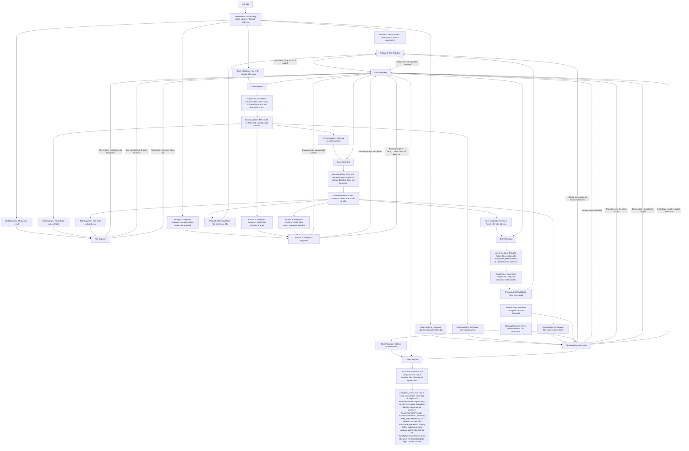

# Lab 03 — Chatbot vs ReAct Agent: Luồng làm việc nhóm

> AI engineer fresher có nền tảng Python

| Thuộc tính | Giá trị |
| --- | --- |
| Repository | `VinUni-AI20k/Day-3-Lab-Chatbot-vs-react-agent-E402` |
| Phiên bản | `main · 68fd266` |
| Thời lượng | 150 phút |
| Nhóm | 5 người |
| Ngày rà soát | 2026-07-31 |

<!-- Các phần còn lại được render từ lab model. -->

## Điểm cần biết trước khi làm

| Phát hiện | Bằng chứng | Ảnh hưởng | Quyết định của guide |
| --- | --- | --- | --- |
| Thời lượng tài liệu không thống nhất | README.md và docs/PHAN_CONG_CONG_VIEC.md chia 4 mốc tổng 150 phút; docs/CODELAB.md khai báo duration 240 phút. | Nhóm cần một timebox duy nhất để phân vai và chốt checkpoint. | Suy luận của coach: dùng 150 phút theo bốn mốc có thời lượng cụ thể; tham chiếu CODELAB khi cần phần giải thích sâu hơn. |
| Runtime chưa chạy trọn bộ test case | config/test_cases.json có 5 case, nhưng src/app.py lấy tests[2] làm sample_query cho hai demo. | Không thể kết luận so sánh Chatbot và Agent trên toàn bộ bộ đề chỉ từ lệnh demo hiện tại. | Giao Role 4 hoàn thiện trách nhiệm chạy và ghi nhận toàn bộ case trước checkpoint đánh giá; không coi demo một case là automated test. |
| Hybrid flowchart là file mới bắt buộc | README.md và docs/PHAN_CONG_CONG_VIEC.md yêu cầu docs/hybrid_flowchart.mermaid; file không có trong tree. | Nhóm phải tạo artifact flowchart trước mốc cuối. | Đánh dấu NEW FILE với contract và validation; guide không cung cấp đáp án sơ đồ. |

## Chuẩn bị môi trường

### Điều kiện ban đầu
- Python 3.10+
- Chạy lệnh từ repository root
- Một bản .env cục bộ; không đưa API key vào artifact nhóm

### Tránh xung đột
- Mỗi role có một file sở hữu; Role 4 là người duy nhất sửa src/app.py.
- Chốt tên tool, input/output contract và định dạng Action trước khi Role 4 tích hợp.
- Dùng LLM_PROVIDER=mock cho smoke test không cần credential; chỉ dùng provider thật sau khi .env đã cấu hình cục bộ.

### Windows

**Tạo môi trường Python**

```powershell
py -m venv .venv
.\.venv\Scripts\Activate.ps1
py -m pip install -r requirements.txt
```
**Kỳ vọng:** Môi trường .venv tồn tại và dependencies được cài.

**Tạo cấu hình cục bộ**

```powershell
Copy-Item .env.example .env
Add-Content .env "`nLLM_PROVIDER=mock"
```
**Kỳ vọng:** Có .env cục bộ chọn MockProvider; API key vẫn để trống.

**Smoke demo offline**

```powershell
py src/app.py
```
**Kỳ vọng:** Hiển thị MockProvider, tải 5 test case, và in demo Chatbot Baseline cùng ReAct Agent.


### macOS

**Tạo môi trường Python**

```bash
python3 -m venv .venv
source .venv/bin/activate
python3 -m pip install -r requirements.txt
```
**Kỳ vọng:** Môi trường .venv tồn tại và dependencies được cài.

**Tạo cấu hình cục bộ**

```bash
cp .env.example .env
printf '\nLLM_PROVIDER=mock\n' >> .env
```
**Kỳ vọng:** Có .env cục bộ chọn MockProvider; API key vẫn để trống.

**Smoke demo offline**

```bash
python3 src/app.py
```
**Kỳ vọng:** Hiển thị MockProvider, tải 5 test case, và in demo Chatbot Baseline cùng ReAct Agent.


### Linux

**Tạo môi trường Python**

```bash
python3 -m venv .venv
source .venv/bin/activate
python3 -m pip install -r requirements.txt
```
**Kỳ vọng:** Môi trường .venv tồn tại và dependencies được cài.

**Tạo cấu hình cục bộ**

```bash
cp .env.example .env
printf '\nLLM_PROVIDER=mock\n' >> .env
```
**Kỳ vọng:** Có .env cục bộ chọn MockProvider; API key vẫn để trống.

**Smoke demo offline**

```bash
python3 src/app.py
```
**Kỳ vọng:** Hiển thị MockProvider, tải 5 test case, và in demo Chatbot Baseline cùng ReAct Agent.

## Vai trò

| Vai trò | Sở hữu | File |
| --- | --- | --- |
| Product & Test Architect | Phạm vi bài toán, test cases và tiêu chí đánh giá | - config/test_cases.json |
| Tool Engineer | Tool contract và registry deterministic | - src/tools.py |
| Prompt & Safeguard Engineer | Baseline prompt, ReAct prompt và guardrails | - src/prompts.py |
| Core Integrator | Entrypoint, orchestration và chạy toàn bộ case | - src/app.py |
| Observability & Reviewer | Scoring matrix, trace, so sánh và hybrid flowchart | - docs/trace_eval.md<br>- docs/hybrid_flowchart.mermaid |

## File quan trọng

| Trạng thái | Đường dẫn | Mục đích | Định dạng/contract |
| --- | --- | --- | --- |
| FILE HIỆN HỮU CẦN SỬA | `config/test_cases.json` | Bộ 5 câu hỏi gồm simple, multi-step và edge case cho so sánh công bằng. | - JSON UTF-8: mỗi phần tử có id, category, question và expected_behavior. |
| FILE HIỆN HỮU CẦN SỬA | `src/tools.py` | Định nghĩa get_weather, search_flights và AVAILABLE_TOOLS. | - Python module; giữ registry AVAILABLE_TOOLS tương thích với src/app.py. |
| FILE HIỆN HỮU CẦN SỬA | `src/prompts.py` | Khai báo baseline prompt, ReAct prompt và MAX_ITERATIONS. | - Python module; giữ các symbol CHATBOT_BASELINE_PROMPT, REACT_SYSTEM_PROMPT và MAX_ITERATIONS. |
| FILE HIỆN HỮU CẦN SỬA | `src/app.py` | Tải test cases, chạy baseline và điều phối ReAct Agent. | - Python entrypoint; giữ load_test_cases, run_baseline_chatbot và run_react_agent. |
| FILE HIỆN HỮU CẦN SỬA | `docs/trace_eval.md` | Lưu scoring matrix, trace và so sánh baseline với agent. | - Markdown với bằng chứng theo từng test case. |
| FILE MỚI BẮT BUỘC | `docs/hybrid_flowchart.mermaid` | Biểu diễn điều kiện chuyển giữa chatbot path và ReAct Agent path. | - Mermaid source UTF-8, không có Markdown fence.<br>- Có điểm quyết định phân loại câu hỏi đơn giản và phức tạp.<br>- Có chatbot path và ReAct Agent path.<br>- Có nhánh fallback/guardrail cho lỗi hoặc vượt giới hạn. |
| CHỈ DÙNG CỤC BỘ · KHÔNG NỘP | `.env` | Cấu hình provider và API key cục bộ. | - Environment variables; không là deliverable. |

### Tạo file mới — `docs/hybrid_flowchart.mermaid`

- **Thư mục chứa:** `docs`
- **Trạng thái thư mục:** Đã tồn tại
- **Nơi sử dụng:** checkpoint mốc 4, rubric Hybrid Decision Flowchart

**Windows**

```powershell
New-Item -ItemType File -Path docs\hybrid_flowchart.mermaid -Force
```

**macOS**

```bash
touch docs/hybrid_flowchart.mermaid
```

**Linux**

```bash
touch docs/hybrid_flowchart.mermaid
```

**Kiểm tra file**

```text
python -c "from pathlib import Path; assert Path('docs/hybrid_flowchart.mermaid').stat().st_size > 0"
```
**Kỳ vọng:** File Mermaid tồn tại và không rỗng.


## Luồng làm việc nhóm đầu-cuối



## Các phase thực hiện

## Phase 1 — Định hình bài toán và chốt contract

- **Thời gian:** 20 phút
- **Chế độ:** Song song
- **Điều kiện bắt đầu:** Smoke demo offline chạy thành công và nhóm đã phân vai.
- **Điều kiện chuyển phase:** Agentic Fit, tool intent, failure modes và test-case scope được Role 4 xác nhận để tích hợp.

| Kiến thức | Hướng dẫn | Đầu ra kỳ vọng | Các file cần nộp |
| --- | --- | --- | --- |
| - Test case là contract giữa người thiết kế và runtime.<br>- Câu hỏi simple không mặc định cần agent. | - `config/test_cases.json`<br>- Hoàn thiện config/test_cases.json theo bốn field đang được runtime đọc.<br>- Bảo đảm bộ đề có case simple, multi-step và edge case phù hợp chủ đề đã chọn. | - Nhóm có contract test để đánh giá chatbot và agent trên cùng input. | - config/test_cases.json |
| - Tool cần contract input, output và lỗi xác định được. | - `src/tools.py`<br>- Xác nhận src/tools.py có tool phục vụ các case multi-step đã chọn.<br>- Giữ AVAILABLE_TOOLS là registry mà src/app.py có thể tiêu thụ. | - Tool intent khớp với test scope và registry load được. | - src/tools.py |
| - Agent cần giới hạn vòng lặp để dừng an toàn.<br>- Prompt là contract đầu ra của model, không phải bằng chứng tool đã chạy. | - `src/prompts.py`<br>- Ghi nhận các failure mode của tool và case bẫy cần được prompt/guardrail xử lý.<br>- Giữ MAX_ITERATIONS là public configuration mà src/app.py nhập. | - Nhóm thống nhất điều kiện dừng và cách phản hồi khi tool không cung cấp được dữ liệu. | - src/prompts.py |
| - Trace cần phân biệt evidence runtime với nhận định. | - `docs/trace_eval.md`<br>- Hoàn thiện phần Agentic Fit trong docs/trace_eval.md theo bốn tiêu chí đang có.<br>- Ghi rõ lý do đánh giá gắn với chủ đề và test scope. | - Có tiêu chí để giải thích khi nào ReAct Agent đáng dùng. | - docs/trace_eval.md |
| - Smoke demo không phải automated test toàn bộ case. | - `src/app.py`<br>- Chạy src/app.py với MockProvider và xác nhận loader đọc được config/test_cases.json.<br>- Ghi nhận nếu runtime chỉ trình diễn một case để phase đánh giá xử lý. | - Entrypoint và baseline repo sẵn sàng nhận các contract của nhóm. | - src/app.py |

### Lệnh kiểm tra

**Chốt phạm vi test và Agentic Fit — Kiểm tra task**

```text
python -m json.tool config/test_cases.json
```
**Kỳ vọng:** JSON hợp lệ và có các case phân loại rõ ràng.

**Chốt phạm vi tool — Kiểm tra task**

```text
python -c "import sys; sys.path.insert(0, 'src'); import tools; print(sorted(tools.AVAILABLE_TOOLS))"
```
**Kỳ vọng:** Registry in được tên các tool đã thống nhất.

**Xác định failure modes và guardrail — Kiểm tra task**

```text
python -c "import sys; sys.path.insert(0, 'src'); import prompts; print(prompts.MAX_ITERATIONS)"
```
**Kỳ vọng:** In một giới hạn vòng lặp dương.

**Lập Scoring Matrix khởi đầu — Kiểm tra task**

```text
python -c "from pathlib import Path; assert 'SCORING MATRIX' in Path('docs/trace_eval.md').read_text(encoding='utf-8').upper(); print('trace template ready')"
```
**Kỳ vọng:** Trace report có section scoring matrix.

**Xác nhận runtime sẵn sàng — Kiểm tra task**

```text
python src/app.py
```
**Kỳ vọng:** Tải 5 test case và in cả hai demo mà không có traceback.


| Vai trò | Công việc | Bàn giao | Commit đề xuất |
| --- | --- | --- | --- |
| Product & Test Architect | Chốt phạm vi test và Agentic Fit | - Product & Test Architect → Core Integrator: Test-case scope JSON đã hợp lệ | - feat: define agent contracts |
| Tool Engineer | Chốt phạm vi tool | - Tool Engineer → Core Integrator: Tool registry và contract đã thống nhất | - feat: define agent contracts |
| Prompt & Safeguard Engineer | Xác định failure modes và guardrail | - Prompt & Safeguard Engineer → Core Integrator: Failure modes và guardrail contract | - feat: define agent contracts |
| Observability & Reviewer | Lập Scoring Matrix khởi đầu | - Observability & Reviewer → Core Integrator: Scoring Matrix khởi đầu | - feat: define agent contracts |
| Core Integrator | Xác nhận runtime sẵn sàng | — | — |

- **File dùng chung:** `src/app.py` — Core Integrator
- **Người tích hợp:** Core Integrator

### Commit đề xuất

- `feat: define agent contracts`
  - Người phụ trách: Core Integrator
  - File: `config/test_cases.json`, `src/tools.py`, `src/prompts.py`, `docs/trace_eval.md`
  - Checkpoint: Contract review complete

## Phase 2 — Baseline chatbot và tool specs

- **Thời gian:** 30 phút
- **Chế độ:** Kết hợp
- **Điều kiện bắt đầu:** Contract phase đã hoàn tất và Role 4 đã xác nhận các handoff.
- **Điều kiện chuyển phase:** Baseline không dùng tool, tool registry có contract rõ, và trace baseline được lưu theo case.

| Kiến thức | Hướng dẫn | Đầu ra kỳ vọng | Các file cần nộp |
| --- | --- | --- | --- |
| - Baseline công bằng chỉ có một LLM response path và không dựa vào tool evidence. | - `src/prompts.py`<br>- Hoàn thiện CHATBOT_BASELINE_PROMPT trong src/prompts.py theo contract baseline của lab.<br>- Giữ interface prompt để run_baseline_chatbot tiếp tục sử dụng. | - Có baseline rõ ràng để so sánh với agent trên cùng câu hỏi. | - src/prompts.py |
| - Tool errors cần là quan sát có thể ghi trace, không làm runtime crash. | - `src/tools.py`<br>- Hoàn thiện docstring và hành vi contract của các tool trong src/tools.py.<br>- Xác nhận case lỗi trả về kết quả quan sát được cho agent. | - Tools có input/output/error contract có thể test độc lập. | - src/tools.py |
| - Output mượt không thay thế được evidence từ tool. | - `docs/trace_eval.md`<br>- Ghi phản hồi baseline cho các case đã thống nhất vào docs/trace_eval.md.<br>- Phân loại từng phản hồi theo correct, safe fallback hoặc hallucinated bằng evidence quan sát được. | - Có bằng chứng baseline trước khi tích hợp agent. | - docs/trace_eval.md |
| - src/app.py là shared integration surface một writer. | - `src/app.py`<br>- Hoàn thiện trách nhiệm run_baseline_chatbot trong src/app.py theo prompt và test contract đã bàn giao.<br>- Giữ load_test_cases tương thích với JSON config. | - Baseline chạy được trên input của config và trace có evidence để đánh giá. | - src/app.py |

### Lệnh kiểm tra

**Hoàn thiện baseline prompt — Kiểm tra task**

```text
python -c "import sys; sys.path.insert(0, 'src'); import prompts; print(bool(prompts.CHATBOT_BASELINE_PROMPT.strip()))"
```
**Kỳ vọng:** In True cho baseline prompt không rỗng.

**Hoàn thiện tool contracts — Kiểm tra task**

```text
python -c "import sys; sys.path.insert(0, 'src'); from tools import get_weather; print(get_weather('Atlantis'))"
```
**Kỳ vọng:** In thông báo không có dữ liệu thay vì traceback.

**Tích hợp và chạy baseline — Kiểm tra task**

```text
python src/app.py
```
**Kỳ vọng:** Demo baseline in response mà không kích hoạt tool path.

**Ghi trace baseline — Kiểm tra thủ công**
- Kiểm tra trace nêu câu hỏi, phản hồi baseline và phân loại cho từng case đã chạy.
- **Kỳ vọng:** Trace có thể đối chiếu lại với config/test_cases.json.


| Vai trò | Công việc | Bàn giao | Commit đề xuất |
| --- | --- | --- | --- |
| Prompt & Safeguard Engineer | Hoàn thiện baseline prompt | - Prompt & Safeguard Engineer → Core Integrator: Baseline prompt đã kiểm tra | - feat: run chatbot baseline with tool contracts |
| Tool Engineer | Hoàn thiện tool contracts | - Tool Engineer → Core Integrator: Tool contracts và lỗi quan sát được | - feat: run chatbot baseline with tool contracts |
| Observability & Reviewer | Ghi trace baseline | - Observability & Reviewer → Core Integrator: Trace baseline theo test scope | - feat: run chatbot baseline with tool contracts |
| Core Integrator | Tích hợp và chạy baseline | — | - feat: run chatbot baseline with tool contracts |

- **File dùng chung:** `src/app.py` — Core Integrator
- **Người tích hợp:** Core Integrator

### Commit đề xuất

- `feat: run chatbot baseline with tool contracts`
  - Người phụ trách: Core Integrator
  - File: `src/prompts.py`, `src/tools.py`, `src/app.py`, `docs/trace_eval.md`
  - Checkpoint: Baseline evidence recorded

## Phase 3 — ReAct loop và safeguards

- **Thời gian:** 60 phút
- **Chế độ:** Kết hợp
- **Điều kiện bắt đầu:** Baseline evidence, tool contracts và test scope đều có sẵn.
- **Điều kiện chuyển phase:** Agent tạo trace Thought–Action–Observation, tôn trọng MAX_ITERATIONS và có fallback cho case bẫy.

| Kiến thức | Hướng dẫn | Đầu ra kỳ vọng | Các file cần nộp |
| --- | --- | --- | --- |
| - Action protocol phải đủ rõ để runtime parse/executor tiêu thụ.<br>- MAX_ITERATIONS là phanh an toàn bắt buộc. | - `src/prompts.py`<br>- Hoàn thiện REACT_SYSTEM_PROMPT và guardrail trong src/prompts.py theo Action/Final Answer contract của lab.<br>- Giữ tên các symbol được src/app.py nhập. | - Model-facing contract nêu rõ action, completion và giới hạn an toàn. | - src/prompts.py |
| - Observation lỗi phải hữu ích cho quyết định tiếp theo hoặc fallback. | - `src/tools.py`<br>- Hoàn thiện behavior của src/tools.py để các input không hỗ trợ có kết quả error contract rõ.<br>- Giữ registry và signature tool tương thích với app. | - Agent có thể nhận observation khi tool không giải quyết được yêu cầu. | - src/tools.py |
| - Runtime phải đưa Observation thực từ tool vào luồng agent.<br>- Một demo case không thay thế đánh giá cả suite. | - `src/app.py`<br>- Hoàn thiện run_react_agent trong src/app.py để dùng prompt, tool registry, test cases và guardrail đã bàn giao.<br>- Mở rộng trách nhiệm runtime để mỗi case trong config/test_cases.json có kết quả có thể ghi trace. | - ReAct Agent có chuỗi Thought–Action–Observation và không vượt quá MAX_ITERATIONS. | - src/app.py |
| - Trace phải ghi được action, observation, kết quả và root cause của failure. | - `docs/trace_eval.md`<br>- Cập nhật docs/trace_eval.md với trace agent và ít nhất một failed/edge case.<br>- So sánh before/after hoặc baseline/agent trên cùng input bằng evidence runtime. | - Có evidence để debug và bảo vệ quyết định agentic. | - docs/trace_eval.md |
| - Edge case là contract an toàn, không chỉ là case khó. | - `config/test_cases.json`<br>- Giữ hoặc hoàn thiện edge case trong config/test_cases.json để kiểm tra failure và fallback.<br>- Đối chiếu expected_behavior với trace agent sau khi Role 4 tích hợp. | - Test suite có bằng chứng cho behavior an toàn của agent. | - config/test_cases.json |

### Lệnh kiểm tra

**Hoàn thiện ReAct prompt và guardrail — Kiểm tra task**

```text
python -c "import sys; sys.path.insert(0, 'src'); import prompts; print(prompts.MAX_ITERATIONS, 'Action:' in prompts.REACT_SYSTEM_PROMPT)"
```
**Kỳ vọng:** In giới hạn dương và True cho Action protocol.

**Xác nhận tool resilience — Kiểm tra task**

```text
python -c "import sys; sys.path.insert(0, 'src'); from tools import get_weather; print(get_weather('Atlantis'))"
```
**Kỳ vọng:** Có observation lỗi có thể ghi nhận, không có traceback.

**Tích hợp ReAct trên toàn bộ case — Kiểm tra task**

```text
python src/app.py
```
**Kỳ vọng:** Mỗi case được chọn cho evaluation có trace; case bẫy dừng an toàn trong giới hạn.

**Ghi trace và failed case — Kiểm tra thủ công**
- Kiểm tra trace có Thought, Action, Observation, kết quả và nhận định cho case bẫy.
- **Kỳ vọng:** Báo cáo giải thích được vì sao agent thành công hoặc fallback.

**Xác nhận case bẫy — Kiểm tra thủ công**
- Chạy edge case và xác nhận có fallback lịch sự hoặc guardrail stop thay vì kết quả bịa.
- **Kỳ vọng:** Trace chứng minh agent dừng an toàn khi dữ liệu/tool không đáp ứng.


| Vai trò | Công việc | Bàn giao | Commit đề xuất |
| --- | --- | --- | --- |
| Prompt & Safeguard Engineer | Hoàn thiện ReAct prompt và guardrail | - Prompt & Safeguard Engineer → Core Integrator: ReAct prompt và MAX_ITERATIONS đã kiểm tra | - feat: add guarded react evaluation |
| Tool Engineer | Xác nhận tool resilience | - Tool Engineer → Core Integrator: Tool registry và observation lỗi | - feat: add guarded react evaluation |
| Core Integrator | Tích hợp ReAct trên toàn bộ case | — | - feat: add guarded react evaluation |
| Observability & Reviewer | Ghi trace và failed case | - Observability & Reviewer → Core Integrator: Trace rubric và evidence cần ghi | - feat: add guarded react evaluation |
| Product & Test Architect | Xác nhận case bẫy | - Product & Test Architect → Core Integrator: Edge case và expected behavior | - feat: add guarded react evaluation |

- **File dùng chung:** `src/app.py` — Core Integrator
- **Người tích hợp:** Core Integrator

### Commit đề xuất

- `feat: add guarded react evaluation`
  - Người phụ trách: Core Integrator
  - File: `config/test_cases.json`, `src/tools.py`, `src/prompts.py`, `src/app.py`, `docs/trace_eval.md`
  - Checkpoint: ReAct trace and safeguard checkpoint pass

## Phase 4 — Cross-audit và hybrid decision flow

- **Thời gian:** 40 phút
- **Chế độ:** Tuần tự
- **Điều kiện bắt đầu:** ReAct trace, failed case analysis và safeguard checkpoint đã hoàn tất.
- **Điều kiện chuyển phase:** Cross-audit evidence, final comparison và hybrid flowchart đều sẵn sàng để nghiệm thu.

| Kiến thức | Hướng dẫn | Đầu ra kỳ vọng | Các file cần nộp |
| --- | --- | --- | --- |
| - Một case lạ kiểm tra khả năng fallback và giải thích, không chỉ happy path. | - `config/test_cases.json`<br>- Chọn case audit từ test suite hoặc phản biện liên nhóm và ghi expected behavior.<br>- Bàn giao kết quả audit cho người tổng hợp trace. | - Nhóm có evidence về hành vi agent ngoài demo sample. | - config/test_cases.json |
| - Flowchart diễn đạt tiêu chí quyết định, không phải answer code. | - `docs/hybrid_flowchart.mermaid`<br>- Tạo docs/hybrid_flowchart.mermaid theo contract NEW FILE.<br>- Thể hiện hai path, điều kiện quyết định và fallback/guardrail bằng thiết kế của nhóm. | - Có artifact phân biệt khi dùng chatbot path và ReAct Agent path. | - docs/hybrid_flowchart.mermaid |
| - Kết luận cần bám test input, trace và flowchart. | - `docs/trace_eval.md`<br>- Hoàn thiện docs/trace_eval.md với so sánh baseline/agent, failed trace và kết quả audit.<br>- Liên kết nhận định Agentic Fit với evidence đã ghi. | - Báo cáo chứng minh được so sánh công bằng và khả năng chịu lỗi. | - docs/trace_eval.md |
| - Nghiệm thu cần xác nhận contract giữa runtime, evidence và artifact. | - `src/app.py`<br>- Chạy app trên scope evaluation đã chốt và kiểm tra các deliverable cuối.<br>- Xác nhận src/app.py vẫn dùng các public interfaces của config, prompts và tools. | - Nhóm có một luồng demo, evidence và artifact thống nhất. | - src/app.py |

### Lệnh kiểm tra

**Tạo hybrid decision flowchart — Kiểm tra task**

```text
python -c "from pathlib import Path; assert Path('docs/hybrid_flowchart.mermaid').stat().st_size > 0"
```
**Kỳ vọng:** Mermaid source tồn tại, không rỗng và có các nhánh contract.

**Nghiệm thu end-to-end — Kiểm tra task**

```text
python src/app.py
```
**Kỳ vọng:** App chạy không traceback; evidence và flowchart khớp checkpoint cuối.

**Chạy cross-audit — Kiểm tra thủ công**
- Chạy case audit trên app và lưu kết quả quan sát được.
- **Kỳ vọng:** Có case audit với kết quả hoặc fallback có thể đối chiếu.

**Hoàn thiện báo cáo evaluation — Kiểm tra thủ công**
- Đối chiếu mọi nhận định trong report với config/test_cases.json, output runtime hoặc cross-audit evidence.
- **Kỳ vọng:** Report giải thích được decision, trace và fallback bằng artifact có thể rà soát.


| Vai trò | Công việc | Bàn giao | Commit đề xuất |
| --- | --- | --- | --- |
| Product & Test Architect | Chạy cross-audit | - Product & Test Architect → Observability & Reviewer: Kết quả cross-audit và expected behavior | - docs: finalize agent evaluation evidence |
| Observability & Reviewer | Tạo hybrid decision flowchart | - Observability & Reviewer → Core Integrator: Final trace report và hybrid flowchart | - docs: finalize agent evaluation evidence |
| Observability & Reviewer | Hoàn thiện báo cáo evaluation | - Observability & Reviewer → Core Integrator: Final trace report và hybrid flowchart | - docs: finalize agent evaluation evidence |
| Core Integrator | Nghiệm thu end-to-end | — | - docs: finalize agent evaluation evidence |

- **File dùng chung:** `src/app.py` — Core Integrator
- **Người tích hợp:** Core Integrator

### Commit đề xuất

- `docs: finalize agent evaluation evidence`
  - Người phụ trách: Core Integrator
  - File: `config/test_cases.json`, `src/app.py`, `docs/trace_eval.md`, `docs/hybrid_flowchart.mermaid`
  - Checkpoint: Final audit checkpoint pass

## Kiểm tra cuối

### Smoke demo offline

```text
python src/app.py
```

**Kỳ vọng:** MockProvider chạy local, loader báo 5 test case và không có traceback.

### Kiểm tra JSON contract

```text
python -m json.tool config/test_cases.json
```

**Kỳ vọng:** JSON hợp lệ.

### Kiểm tra secret cục bộ

```text
Select-String -Path .env -Pattern 'your_.*_api_key_here' -Quiet
```

**Kỳ vọng:** Chỉ là template placeholder hoặc cấu hình cục bộ; API key không nằm trong deliverable.
- Không chia sẻ .env hoặc API key trong artifact nhóm.

## Điều kiện hoàn thành

- [ ] config/test_cases.json hợp lệ và có case simple, multi-step và edge case.
- [ ] Baseline và ReAct Agent được so sánh trên scope evaluation đã chốt bằng trace có evidence.
- [ ] ReAct Agent ghi Thought–Action–Observation, tôn trọng MAX_ITERATIONS và có fallback cho case bẫy.
- [ ] docs/trace_eval.md có scoring matrix, failed/cross-audit evidence và kết luận Agentic Fit.
- [ ] docs/hybrid_flowchart.mermaid tồn tại và mô tả chatbot path, agent path và fallback.

## Nguồn repository đã rà soát

- `README.md`
- `docs/CODELAB.md`
- `docs/PHAN_CONG_CONG_VIEC.md`
- `docs/trace_eval.md`
- `config/test_cases.json`
- `src/app.py`
- `src/tools.py`
- `src/prompts.py`

