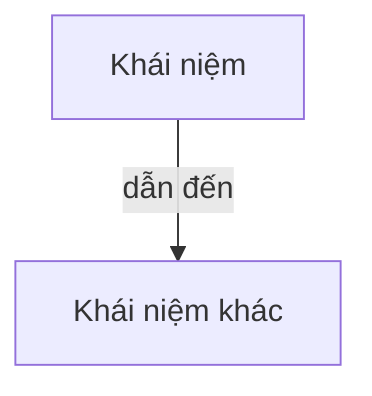

# Sơ đồ tư duy / mindmap

Cơ sở: dual coding — mã hoá kiến thức cả bằng lời lẫn hình ảnh/không gian thì nhớ chắc hơn.

Giao diện web Vlearn render code mermaid thành HÌNH; nên LUÔN xuất trong code block ```mermaid.

## Quy trình
- [ ] 1. `get_lesson` bài (hoặc `search_lessons` nếu là chủ đề xuyên bài); lấy các [[wikilink]] và mục "Khái niệm chính".
- [ ] 2. Chọn 4–6 nhánh chính; mỗi nhánh 2–4 ý con; mỗi ý con (tuỳ) 1 dòng giải thích ngắn. Chỉ dùng khái niệm CÓ trong tài liệu.
- [ ] 3. MẶC ĐỊNH xuất dạng **mindmap** (tỏa tròn — web vẽ đẹp nhất). Thụt lề đúng 2 dấu cách mỗi cấp:
      ```mermaid
      mindmap
        root((Chủ đề chính))
          Nhánh 1
            Ý con
              Giải thích ngắn
            Ý con 2
          Nhánh 2
            Ý con
      ```
- [ ] 4. Dưới sơ đồ: 2–3 dòng chú giải cách đọc ("nhánh X là cốt lõi vì...").
- [ ] 5. Hỏi học viên muốn phóng to nhánh nào → vẽ mindmap con chi tiết cho nhánh đó.

## Khi cần thể hiện QUAN HỆ CHÉO (không phải cây)
Nếu muốn nối các khái niệm với nhau (dẫn-đến, cần-trước, vòng lặp) thì dùng `graph TD` thay vì mindmap:


## Nhãn — BẮT BUỘC để render đúng
- Nhãn NGẮN (1–5 từ), tiếng Việt/Anh bình thường. KHÔNG in đậm `**...**`, KHÔNG `_..._`.
- KHÔNG chèn dấu ngoặc `()[]{}` bên trong nhãn (chỉ `root(( ))` là cú pháp gốc).
- KHÔNG dùng `#`, `"`, `:` trong nhãn; mỗi nút một dòng.

## Lưu ý
- Cây quá to (>6 nhánh hoặc >~25 nút) = rối → tách mindmap tổng quan + mindmap con.
- Chỉ dùng khái niệm CÓ trong tài liệu; đừng chế thêm nút ngoài giáo trình.
