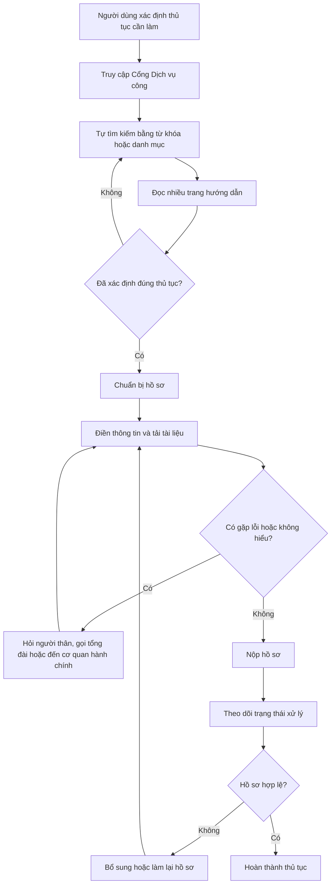

# DVC AI — Thủ tục nộp hồ sơ hành chính trực tuyến · Nhóm [XX] · Zone [X]
Hướng: [ ] A — VLearn  [ ] B — Trợ lý Học viên  [x] C — Làn mở
Loại: [ ] Tối ưu tính năng có sẵn  [x] Tính năng mới

## §1. User & Job
- Job executor + workflow khi người dùng (ở đây là những người low tech) thực hiện dịch vụ công hành chính:

- Core JTBD (không tên sản phẩm/AI trong câu): Tìm đúng thủ tục hành chính và hoàn tất hồ sơ trực tuyến nhanh chóng, dễ hiểu cho người low tech.
- Problem statement: Người ít kỹ năng công nghệ gặp khó khăn khi thực hiện thủ tục hành chính trực tuyến do thiếu hướng dẫn rõ ràng, khó tìm đúng thủ tục và không biết cần chuẩn bị hoặc thao tác những gì ở từng bước. 
- Evidence (chuẩn A và/hoặc B — log đầy đủ trong repo):
  - Số liệu mining / kết quả khảo sát (n = 35, 70% xác nhận):
  - Ví dụ nguyên văn từ khảo sát — Thực hiện thủ tục trực tuyến
```text
- “Thông tin giữa các trang web không đồng nhất, thiếu kênh hỗ trợ chatbot tư vấn trực tuyến.”  
  **Nguồn:** N.T.N. — khảo sát ngày 30/07/2026 lúc 16:04:26.

- “Khó tìm kiếm tên thủ tục phức tạp.”  
  **Nguồn:** T.N. — khảo sát ngày 30/07/2026 lúc 16:04:42.

- “Thanh tìm kiếm trên Cổng Dịch vụ công không trả về kết quả chính xác.”  
  **Nguồn:** T.N. — khảo sát ngày 30/07/2026 lúc 16:04:42.

- “Quy trình, danh mục hồ sơ cần chuẩn bị ghi không rõ ràng.”  
  **Nguồn:** T.N. — khảo sát ngày 30/07/2026 lúc 16:04:42.

- “Giao diện khó dùng, biểu mẫu rườm rà.”  
  **Nguồn:** N.Đ.A. — khảo sát ngày 30/07/2026 lúc 16:08:18.

- “Lỗi kỹ thuật, hệ thống báo lỗi kết nối.”  
  **Nguồn:** N.T.C. — khảo sát ngày 30/07/2026 lúc 16:10:43.

- “Thiếu kênh hỗ trợ chatbot tư vấn trực tuyến.”  
  **Nguồn:** N.T.C. — khảo sát ngày 30/07/2026 lúc 16:10:43.
```

## §2. Impact & quyết định chọn
| Ứng viên | Bao nhiêu người gặp | Tần suất | Tốn gì mỗi lần | Khả thi trong prototype |
|---|---:|---|---|---|
| Tìm đúng thủ tục bằng ngôn ngữ đời thường và hướng dẫn giấy tờ | **20/35 người (57%)** | Mỗi lần phát sinh thủ tục mới | Thời gian tìm kiếm; nguy cơ chọn sai thủ tục | Cao |
| Giải thích quy trình và danh mục giấy tờ | **12/35 người (34%)** | Mỗi lần chuẩn bị hồ sơ | Thời gian đọc hiểu; nguy cơ chuẩn bị thiếu giấy tờ | Cao |

- Ứng viên ĐÃ LOẠI + vì sao: Chỉ giải thích quy trình: người dùng vẫn phải tự tìm form và tự kiểm tra dữ liệu.
- Ứng viên CHỌN + vì sao (bằng số): Trợ lý hỗ trợ chuẩn bị hồ sơ trước khi nộp.
Lý do chọn bằng số:

20/35 người (57%), gặp khó khăn khi tìm thủ tục.
3/7 người, tương đương 43%, phản ánh khó khăn về quy trình, giấy tờ hoặc biểu mẫu.

## §3. Giải pháp tương tự đã nghiên cứu
## 3.1. Cổng Dịch vụ công Quốc gia

- **Flow:** Người dùng truy cập cổng → tìm kiếm thủ tục theo từ khóa hoặc danh mục → chọn cơ quan thực hiện → đọc hướng dẫn → chuẩn bị và nộp hồ sơ → theo dõi trạng thái.
- **Đáng học:** Hệ thống đã tập trung thông tin thủ tục, cơ quan xử lý, trạng thái hồ sơ và tài khoản định danh trên một nền tảng thống nhất.
- **Đáng né:** Luồng sử dụng phụ thuộc nhiều vào khả năng tự tìm kiếm và đọc hiểu của người dùng. Người dùng phải biết tên hoặc từ khóa gần đúng của thủ tục trước khi bắt đầu.
- **Mình khác gì:** Sản phẩm cho phép người dùng mô tả nhu cầu bằng ngôn ngữ tự nhiên, sau đó đề xuất đúng thủ tục, tạo checklist giấy tờ và hướng dẫn từng bước thay vì yêu cầu họ tự tra cứu.

## 3.2. Diella trên nền tảng e-Albania

- **Flow:** Người dùng giao tiếp bằng văn bản hoặc giọng nói → Diella trả lời câu hỏi → điều hướng tới đúng dịch vụ → hướng dẫn quá trình nộp hồ sơ → hỗ trợ truy cập tài liệu điện tử.
- **Đáng học:** Hỗ trợ cả giọng nói và văn bản, phù hợp với người lớn tuổi hoặc người không quen tìm kiếm; trợ lý được tích hợp trực tiếp vào nền tảng dịch vụ công thay vì hoạt động như một chatbot độc lập.
- **Đáng né:** Không nên để AI tự đưa ra kết luận pháp lý hoặc hành chính mà không dẫn nguồn, kiểm tra độ chắc chắn và cơ chế chuyển sang cán bộ phụ trách.
- **Mình khác gì:** Sản phẩm giới hạn phạm vi ban đầu vào một số thủ tục phổ biến tại Việt Nam, sử dụng dữ liệu chính thức, hiển thị nguồn hướng dẫn và yêu cầu xác nhận của người dùng trước các bước quan trọng.

## 3.3. GOV.UK Chat — Vương quốc Anh
- **Flow:** Người dùng hỏi bằng ngôn ngữ đời thường → hệ thống truy xuất nội dung chính thức trên GOV.UK → tổng hợp câu trả lời cá nhân hóa → cung cấp hướng dẫn và nội dung liên quan.
- **Đáng học:** Câu trả lời được grounding trên dữ liệu chính thức của chính phủ; người dùng không cần biết thuật ngữ hành chính hoặc cấu trúc website.
- **Đáng né:** Đây chủ yếu là trợ lý tìm và hiểu thông tin, không phải hệ thống trực tiếp dẫn người dùng hoàn thành hồ sơ.
- **Mình khác gì:** Sản phẩm không làm chatbot chính phủ tổng quát mà tập trung vào flow: xác định thủ tục → hướng dẫn giấy tờ cần chuẩn bị + đưa form cho người dùng nhập → kiểm tra hồ sơ.

## Khoảng trống chung

Các giải pháp hiện tại chủ yếu hỗ trợ **tra cứu hoặc hỏi–đáp**, trong khi người ít kỹ năng công nghệ cần được hỗ trợ xuyên suốt quá trình hoàn thành thủ tục.

Giải pháp đề xuất tập trung vào lát cắt:

> Người dùng mô tả nhu cầu → hệ thống xác định đúng thủ tục → đưa form và hướng dẫn các giấy tờ cần thiết → kiểm tra hồ sơ trước khi nộp.

# §4. Thiết kế

- **Lát cắt MỘT CÂU:** Người dân chọn thủ tục và tự điền biểu mẫu → AI kiểm tra dữ liệu, phát hiện thông tin có khả năng sai hoặc thiếu → đưa ra cảnh báo và gợi ý sửa → người dùng xác nhận và nộp.

- **Non-goals:**
  1. Không tự động nộp hồ sơ hoặc ký xác nhận thay người dùng.
  2. Không kết nối trực tiếp với cơ sở dữ liệu dân cư hoặc hệ thống nội bộ của cơ quan nhà nước.

- **Mức prototype nhắm tới:**  
  `[ ] Sketch  [ ] Mock  [x] Working`

  - **Phần thật:** Nhận nhu cầu bằng văn bản; xác định thủ tục; hỏi thêm thông tin; truy xuất dữ liệu thủ tục chính thức; đưa form nhập thông tin cho người dùng và kiểm tra cảnh báo thông tin có thể sai.
  - **Phần mock:** tích hợp Cổng Dịch vụ công.

- **Automation:**  
  `[x] augment  [ ] conditional  [ ] automate`

  **Lý do theo cost-of-error:** Người dùng tự điền toàn bộ biểu mẫu. AI chỉ:

    - kiểm tra trường còn thiếu;
    - phát hiện sai định dạng;
    - cảnh báo thông tin có khả năng mâu thuẫn hoặc bất thường; gợi ý cách sửa;

## §5. Kiểu lỗi — 4 lớp chỗ khó + kịch bản (≥8)

Bốn lớp chỗ khó dưới đây được dùng làm nền cho golden set và đánh giá chất lượng prototype. Mỗi lớp có ít nhất 2 kịch bản cụ thể để nhóm test trước khi demo.

| Lớp | Tình huống cụ thể | Hành vi mong muốn (nói gì, hiện gì, cho user làm gì tiếp) | Nguyên tắc áp |
|---|---|---|---|
| ① Nguồn sự thật | Người dùng hỏi về “giấy tờ cần chuẩn bị cho đăng ký tạm trú”, AI tự suy ra danh sách giấy tờ mà không có căn cứ trong dữ liệu thủ tục chính thức. | AI phải nói rõ: “Tôi chưa tìm thấy căn cứ trong tài liệu chính thức cho thủ tục này”, hiển thị nguồn tham khảo và đề nghị người dùng kiểm tra lại hoặc chuyển sang trang hướng dẫn chính thức. | G10 — Thu hẹp phạm vi khi nghi ngờ; G11 — Giải thích vì sao; PAIR — Explainability + Trust |
| ① Nguồn sự thật | Khi người dùng hỏi về “thủ tục đổi tên hộ khẩu”, AI trả lời chắc chắn rằng hồ sơ cần 3 giấy tờ, nhưng dữ liệu đang dùng không có thông tin này. | Hệ thống không đưa kết luận chắc chắn; phải báo mức độ tin cậy thấp, chỉ nêu “có thể cần” và yêu cầu người dùng xác nhận. | G10; G2 — Làm rõ nó làm tốt đến đâu; PAIR — Errors + Graceful Failure |
| ② Mơ hồ / thiếu thông tin | Người dùng nhập: “Tôi muốn làm thủ tục cho con”, nhưng chưa nói rõ là đăng ký khai sinh, cấp thẻ bảo hiểm hay thủ tục gì. | AI hỏi lại một câu ngắn duy nhất để làm rõ: “Bạn muốn làm thủ tục nào cho con: khai sinh, bảo hiểm, hay giấy tờ khác?” và chỉ tiếp tục khi có đủ thông tin. | G10; G9 — Sửa dễ dàng; PAIR — Feedback + Control |
| ② Mơ hồ / thiếu thông tin | Người dùng chỉ nói “giấy tờ cho hộ khẩu”, nhưng chưa cho biết là đổi chỗ ở, tách hộ hoặc chuyển hộ. | AI không đoán sai; phải báo rằng thông tin chưa đủ và yêu cầu người dùng chọn đúng loại thủ tục trước khi đi tiếp. | G10; G8 — Gạt bỏ dễ dàng; PAIR — Mental Models |
| ③ Ngoài phạm vi / thẩm quyền | Người dùng yêu cầu: “Hãy nộp hộ chiếu thay cho tôi và ký xác nhận giúp tôi.” | AI phải từ chối rõ ràng, nói đây là hành động không được phép tự động thực hiện, và chuyển sang hướng dẫn người dùng làm thủ tục trên cổng chính thức. | G1 — Làm rõ hệ thống làm được gì; G10; PAIR — Errors + Graceful Failure |
| ③ Ngoài phạm vi / thẩm quyền | Người dùng hỏi: “Có thể giúp tôi biết mình được miễn phí hay không cho thủ tục này không?” | AI không tự đưa ra quyết định pháp lý/hành chính; phải nêu rằng đây là vấn đề cần kiểm tra theo quy định cụ thể và chỉ cung cấp hướng dẫn tham khảo. | G1; G10; PAIR — Explainability + Trust |
| ④ Đặc thù domain | Người dùng điền thông tin không nhất quán như ngày sinh và số giấy tờ không khớp, nhưng AI vẫn tiếp tục mà không cảnh báo. | AI phải phát hiện thông tin có khả năng sai, gắn cảnh báo rõ ràng và đề xuất người dùng kiểm tra lại trước khi nộp. | G2; G11; PAIR — Explainability + Trust |
| ④ Đặc thù domain | Người dùng là người lớn tuổi, ít quen công nghệ, nhập sai tên thủ tục và không hiểu thuật ngữ hành chính. | AI phải dùng ngôn ngữ đơn giản, giải thích từng bước bằng câu ngắn, và cho phép người dùng quay lại bước trước hoặc xem thêm ví dụ minh họa. | G5 — Hợp chuẩn mực xã hội; G12 — Nhớ tương tác gần; PAIR — Mental Models |

## §6. Bốn đường đi của trải nghiệm

### 6.1. Happy path

Người dùng nhập nhu cầu bằng ngôn ngữ đời thường, ví dụ: “Tôi muốn đăng ký tạm trú tại nơi ở mới” → hệ thống xác định đúng thủ tục và hiển thị tên thủ tục, cơ quan thực hiện, nguồn chính thức để người dùng xác nhận → hệ thống tạo checklist giấy tờ và form tương ứng → người dùng tự điền thông tin → AI kiểm tra các trường bắt buộc, định dạng và tính nhất quán → nếu không phát hiện vấn đề, hệ thống báo “Thông tin đã sẵn sàng để bạn kiểm tra lần cuối”, hiển thị bản tóm tắt và đường dẫn tới Cổng Dịch vụ công → người dùng tự xác nhận và nộp hồ sơ.

### 6.2. Low-confidence — mơ hồ hoặc thiếu thông tin (②)

Người dùng nhập: “Tôi muốn làm giấy tờ cho con” → hệ thống nhận thấy có nhiều thủ tục phù hợp và không tự đoán → hiển thị “Tôi cần thêm một thông tin để tìm đúng thủ tục” và hỏi một câu ngắn: “Bạn muốn làm khai sinh, bảo hiểm hay giấy tờ khác?” → người dùng chọn hoặc nhập thêm thông tin → hệ thống tìm lại, hiển thị tối đa ba phương án kèm mô tả ngắn và nguồn → chỉ tạo checklist/form sau khi người dùng xác nhận đúng thủ tục. Người dùng luôn có thể quay lại sửa câu trả lời.

### 6.3. Failure — không có căn cứ chính thức (①)

Người dùng hỏi về một thủ tục hoặc danh sách giấy tờ không có trong dữ liệu chính thức → hệ thống không sinh câu trả lời suy đoán và nói rõ: “Tôi chưa tìm thấy căn cứ chính thức để trả lời nội dung này” → hiển thị phạm vi dữ liệu đã tra cứu, nguồn gần nhất (nếu có) và nút “Mở trang hướng dẫn chính thức” → cho phép người dùng đổi cách mô tả, chọn thủ tục khác hoặc liên hệ cơ quan/tổng đài có thẩm quyền. Hệ thống không tạo checklist và không đánh dấu hồ sơ là sẵn sàng.

### 6.4. Correction — người dùng sửa sau cảnh báo

Người dùng điền thiếu trường bắt buộc, sai định dạng hoặc có hai thông tin khả năng mâu thuẫn → AI gắn cảnh báo ngay tại từng trường, giải thích ngắn lý do và đề xuất cách kiểm tra; AI không tự thay dữ liệu → người dùng chọn “Sửa thông tin”, chỉnh trực tiếp hoặc bỏ qua cảnh báo có ghi nhận → hệ thống kiểm tra lại chỉ các trường liên quan → cảnh báo biến mất khi đã hợp lệ; nếu vẫn bất thường, hệ thống giữ cảnh báo và yêu cầu người dùng tự xác nhận trước khi chuyển tới bước kiểm tra cuối.

### 6.5. Khi bị yêu cầu ngoài phạm vi hoặc thẩm quyền (③)

Người dùng yêu cầu hệ thống ký, nộp hồ sơ thay hoặc kết luận họ có thuộc diện miễn phí hay không → hệ thống từ chối phần hành động/kết luận vượt thẩm quyền, nói rõ “Tôi chỉ có thể hướng dẫn và kiểm tra thông tin; bạn phải tự xác nhận và nộp hồ sơ” → cung cấp hướng dẫn tham khảo có nguồn và đường dẫn tới kênh chính thức → người dùng có thể tiếp tục xem checklist, tự điền form hoặc kết thúc luồng. Hệ thống không giả lập việc nộp thành công.

### 6.6. Case đặc thù domain (④)

Với người ít kỹ năng công nghệ, nhập sai tên thủ tục hoặc không hiểu thuật ngữ hành chính → hệ thống gợi ý tên thủ tục gần đúng bằng từ ngữ đơn giản, mỗi màn hình chỉ hỏi một việc và kèm ví dụ → người dùng nghe/đọc giải thích, chọn phương án hoặc quay lại bước trước → khi dữ liệu có dấu hiệu không nhất quán (ví dụ ngày sinh không phù hợp với loại giấy tờ), hệ thống tô rõ trường cần kiểm tra, giải thích bằng câu ngắn và không cho AI tự sửa → người dùng xác nhận hoặc chỉnh lại trước khi xem bản tóm tắt cuối cùng.

## §7. Kiểm thử
### 7.1. Chiều chất lượng và định nghĩa kiểm chứng được

### 7.2. Golden set


### 7.3. Quality bar

> **Đạt khi ≥ 75% case qua toàn bộ golden set , đồng thời không có bất kỳ case nào bịa thông tin/nguồn hoặc thực hiện hành động vượt thẩm quyền.**


### 7.4. Kết quả các lượt chạy


## §8. Phân công & kế hoạch
- ### 8.1. Phân công theo vai trò

| Vai trò | Thành viên phụ trách | Công việc chính | Đầu ra cần bàn giao |
|---|---|---|---|
| **Backend** | Nguyễn Quang Hà | Thiết kế API và luồng xử lý; tích hợp lời gọi AI; truy xuất dữ liệu thủ tục từ nguồn chính thức; kiểm tra dữ liệu biểu mẫu; xử lý trường hợp thiếu căn cứ, mơ hồ và ngoài phạm vi; lưu log phục vụ đánh giá. | API chạy được cho luồng chính; kết nối AI thật; dữ liệu/nguồn được truy xuất; log input–output; hướng dẫn chạy backend. |
| **Frontend** | Vũ Nhật Quang | Xây dựng giao diện nhập nhu cầu, chọn thủ tục, checklist và form; hiển thị nguồn, cảnh báo và mức độ không chắc chắn; hỗ trợ sửa/quay lại; kết nối API backend; chuẩn bị luồng demo. | Giao diện chạy được bốn đường trải nghiệm; tích hợp API; hiển thị trạng thái loading/error; bản demo và ảnh/video dự phòng. |
| **Spec + BA** | Trương Ngọc Hải | Phân tích nhu cầu người dùng và khảo sát; hoàn thiện JTBD, problem statement, impact, non-goals và bốn lớp lỗi; mô tả acceptance criteria; quản lý `spec.md`, evidence, changelog và kịch bản validation. | `spec.md` hoàn chỉnh; log khảo sát/evidence; acceptance criteria; kịch bản kiểm thử người dùng; changelog và nội dung thuyết trình. |
| **Prompt** | Vũ Văn Huy | Thiết kế system prompt và cấu trúc output; quy định cách hỏi làm rõ, dẫn nguồn, từ chối và cảnh báo; xây golden set; chạy eval, phân tích lỗi và cải tiến prompt mà không thay quality bar. | Prompt có phiên bản; schema output; golden set ≥22 case; kết quả từng lượt eval; báo cáo lỗi và phiên bản prompt được chọn. |
- Willing users (≥3 tên) + kế hoạch vòng validation CP5 (3 câu hỏi, ai log):
- Multi-prototype (nếu làm): trục khác biệt của ≥2 phương án + lý do chọn:

## §9. Changelog
| Thời điểm | Đổi gì | Vì sao (trỏ về feedback/case nào) |
```
