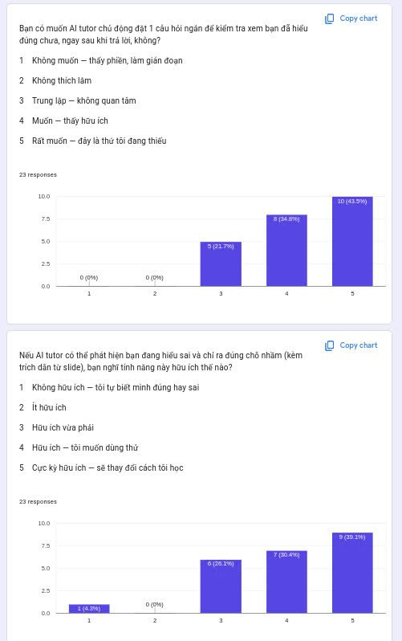

# AI SPEC — Comprehension Gap Detector · Nhóm Gemini4 · Zone 3
Hướng: [X] A — VLearn  [ ] B — Trợ lý Học viên  [ ] C — Làn mở

Loại: [ ] Tối ưu tính năng có sẵn  [X] Tính năng mới

---

## §1. User & Job

- **Job executor:** Học viên khoá AI Thực Chiến, đang đọc tài liệu slide trên VLearn trong giờ học (conversation_mode = `in_class`), bôi đen đoạn văn và dùng AI tutor để hiểu khái niệm AI/LLM

- **Core JTBD:** Học viên muốn **xác nhận mình đang hiểu đúng** một khái niệm kỹ thuật vừa đọc, để tiếp tục học phần tiếp theo mà không mang theo hiểu lầm tiềm ẩn

- **Problem statement:** Học viên bôi đen đoạn tài liệu và đặt câu hỏi cho tutor để hiểu khái niệm — nhưng câu hỏi của họ thường ẩn chứa hiểu lầm (misconception) mà tutor không phát hiện ra — dẫn đến học viên tiếp tục với kiến thức sai và chỉ phát hiện lỗ hổng khi làm lab/bài kiểm tra, lúc đó phải unlearn rất tốn công

- **Evidence (chuẩn B — mining chatlog thật):**
  - **Phạm vi:** 1.261 turns (2.522 messages), 369 học viên, 585 hội thoại, 22–29/07/2026
  - **Số liệu mining:**
    - `asked_check_question = True`: **3/1.261 turns (0.24%)** — tutor gần như không bao giờ chủ động kiểm tra hiểu bài
    - Field `misconceptions`: **0/1.261 turns có giá trị** — tính năng detect misconception chưa từng được build dù field tồn tại trong DB
    - Field `follow_ups`: **0/1.261 turns có giá trị** — idem
    - Tutor từ chối / "rất tiếc không tìm thấy": **301/1.261 turns (23.9%)**
    - `review_concept` không có citation: **448/1.074 (41.7%)** — trả lời không grounded vào tài liệu
    - Rating `down`: **37 turns** — phần lớn khi tutor từ chối hoặc không có context
  - **≥5 ví dụ nguyên văn từ chatlog:**
    1. `[T0769]` Student: "giải thích nghĩa chi tiết của trang 4" → Tutor: "Rất xin lỗi vì hiện tại hệ thống tìm kiếm không tìm thấy nội dung cụ thể cho trang 4..." (rating: down)
    2. `[T0408]` Student: "tóm tắt các chủ đề chính của slide day05-lecture-slides-batch03.pdf" → Tutor: "Rất tiếc, tôi không thể tìm thấy tệp tin..." (rating: down)
    3. `[T1258]` Student: "tóm tắt slide này" (Trang 33) → Tutor: "Rất tiếc là tôi đã tra cứu nhưng chưa tìm thấy nội dung cụ thể của Trang 33..." (rating: down)
    4. `[T0776]` Student: "giải thích và tóm tắt nội dung học hôm này" → Tutor: "Xin lỗi bạn, tôi không tìm thấy phần tóm tắt tổng quát..." (rating: down)
    5. `[T1098]` Student hỏi về đoạn code few-shot prompting → Tutor trả lời review_concept nhưng citations = [] (rating: down)
    6. (Ngược lại) Up-rated turns: khi tutor có citation `[trang 17]`, `[trang 43]` → học viên rate up
  - **Phương pháp đếm:** Đọc toàn bộ file CSV, lọc theo field `asked_check_question`, `misconceptions`, `follow_ups`, `rating`; keyword search "rất tiếc"/"xin lỗi"/"không tìm thấy" trong cột `content` của role=tutor. Script tại `eval/analyze_chatlog.py`.
  - **Bằng chứng đường A (khảo sát):** Kết quả khảo sát Google Form trên 23 học viên đã từng sử dụng VLearn:
    - n = 23, 100% có câu 3 ≥ 3 điểm (xác nhận pain), 96% có câu 4+5 ≥ 4 (willing to use)

  

---

## §2. Impact & quyết định chọn

**Bảng impact — 3 ứng viên:**

| Ứng viên | Người gặp | Tần suất | Tốn gì mỗi lần | Build được không | Chọn? |
|---|---|---|---|---|---|
| **Misconception Detector + Check Question** | 369 học viên | Mỗi lần hỏi tutor (~3–5 lần/buổi) | Học sai KT → làm sai lab → mất điểm; ~15–30p để unlearn 1 khái niệm | Có: 1 Gemini call | **CHỌN** |
| Fix tutor từ chối (301/1.261 = 23.9%) | 369 học viên | 1–2 lần/buổi | Frustration, bỏ hỏi, hỏi bạn thay vì tutor | Cần thêm RAG pipeline phức tạp | Loại |
| Auto-quiz cuối buổi | 369 học viên | 1 lần/buổi | Không biết học được gì đến bài sau mới vỡ | Dễ build | Loại |

**Ứng viên đã loại + lý do:**
- *Fix tutor từ chối:* Pain rõ (23.9% turns) nhưng giải pháp đòi sửa RAG pipeline — quá phức tạp để build working trong 1.5 ngày; pain là UX frustration, không phải kiến thức sai
- *Auto-quiz cuối buổi:* Build được nhưng impact thấp hơn — quiz cuối buổi không can thiệp được vào điểm sai lúc hiểu lầm đang hình thành; nhiều sản phẩm khác đã có (Quizlet, Khanmigo)

**Ứng viên chọn + lý do bằng số:**
- Misconception Detector: 0/1.261 turns là bằng chứng feature chưa tồn tại mạnh nhất; high-stakes (sai KT AI = dự án thực chiến sai theo); build được với 1 Gemini call trong thời gian hackathon

---

## §3. Giải pháp tương tự đã nghiên cứu

- **Khanmigo (Khan Academy):** Flow: học sinh hỏi → hỏi ngược lại Socratic. Đáng học: kỹ thuật Socratic questioning. Đáng né: frustrating khi học viên đã biết cơ bản. Mình khác: chỉ hỏi ngược khi detect được misconception cụ thể
- **NotebookLM (Google):** Flow: upload tài liệu → hỏi → trả lời kèm citation inline. Đáng học: luôn cite nguồn cụ thể trong câu trả lời. Đáng né: không có comprehension check, chỉ thụ động. Mình khác: thêm lớp phân tích misconception + check-question chủ động
- **Duolingo (grammar hints):** Flow: viết sai → highlight đỏ + gợi ý sửa ngay. Đáng học: feedback immediate và in-context. Đáng né: quá tự động, nhiều false positive. Mình khác: chỉ flag khi AI confidence cao, cho dismiss dễ dàng

---

## §4. **Thiết kế**

- **Lát cắt MỘT CÂU:**
  > Học viên đang đọc slide trên VLearn · bôi đen đoạn tài liệu và gõ câu hỏi vào tutor · AI quyết định xem câu hỏi có ẩn chứa misconception không và sinh 1 câu check-question đúng trọng tâm · học viên nhận ra chỗ hiểu sai ngay trong buổi học thay vì phát hiện muộn khi làm lab

- **Non-goals (KHÔNG build):**
  1. Không tự động gửi thông báo cho giảng viên khi học viên hiểu sai
  2. Không lưu lịch sử misconception của từng học viên theo thời gian (bản đồ lỗ hổng)
  3. Không sinh quiz nhiều câu — chỉ 1 câu check ngay sau mỗi turn
  4. Không thay thế câu trả lời của tutor — chỉ bổ sung thêm lớp check

- **Mức prototype nhắm tới:** [X] Working
  - Phần thật: Gemini API call với prompt phát hiện misconception + sinh check-question, dùng transcript làm context
  - Phần mock: UI bôi đen đoạn slide (simulate bằng text input), không integrate vào VLearn thật

- **Automation:** [X] Conditional
  - Lý do theo cost-of-error: False positive (học viên hiểu đúng nhưng bị báo sai) -> mất niềm tin vào tutor, frustration, ngừng dùng. Sai này đắt hơn việc bỏ sót 1 misconception. -> AI chỉ flag khi confidence cao; câu hỏi mơ hồ/ngắn -> hỏi lại 1 câu trước

### §4b. Nguyên tắc đã áp dụng (HAX/PAIR)

| Nguyên tắc | Áp cụ thể vào đâu trong prototype |
|---|---|
| **G2 — Làm rõ độ tin cậy** | Khi flag misconception: "Mình thấy có thể có nhầm lẫn..." — không dùng ngôn ngữ tuyệt đối "bạn đang hiểu sai" |
| **G10 — Thu hẹp phạm vi khi nghi ngờ** | Câu hỏi quá ngắn/mơ hồ -> AI hỏi lại 1 câu làm rõ context trước khi phân tích |
| **G9 — Sửa dễ dàng** | Học viên bấm [Bỏ qua] để dismiss alert nếu biết mình đúng — không chặn flow |
| **G11 — Giải thích vì sao** | Mỗi flag kèm giải thích + citation trang cụ thể: "vì đoạn bạn chọn ở trang 6 nói rằng..." |
| **G15 — Mời feedback** | Sau check-question: "Hữu ích / Quá khó / Không liên quan" — dùng để cải thiện prompt |

---

## §5. Kiểu lỗi — 4 lớp chỗ khó + kịch bản (>=8)

| # | Tình huống cụ thể | Lớp | Hành vi mong muốn | Nguyên tắc |
|---|---|---|---|---|
| 1 | AI flag misconception nhưng học viên hiểu đúng (false positive) | 1 Nguồn sự thật | Học viên bấm [Bỏ qua] dễ; AI không lặp lại flag; không ảnh hưởng câu trả lời chính | G9, G8 |
| 2 | AI không tìm thấy đoạn transcript tương ứng slide đang xem | 1 Nguồn sự thật | Trả lời bình thường + ghi chú "không tìm thấy trong tài liệu, dựa trên kiến thức chung" — không bịa citation | G2, G11 |
| 3 | Câu hỏi quá ngắn: "slide 9 là gì?" | 2 Mơ hồ/thiếu TT | Hỏi lại: "Bạn muốn hiểu khái niệm nào trong slide 9? Mô tả ngắn gọn điều đang thắc mắc" | G10 |
| 4 | Câu hỏi ngoài tài liệu: "tutor được tạo từ LLM nào?" | 2 Mơ hồ/thiếu TT | Trả lời ngắn + redirect: "Câu này mình trả lời theo KT chung. Bạn có muốn quay lại bài học không?" | G10 |
| 5 | Đòi tóm tắt toàn bộ slide: "tóm tắt toàn bộ day05" | 3 Ngoài phạm vi | "Mình chỉ giải thích đoạn bạn bôi đen. Để tóm tắt toàn bộ, bạn hỏi từng phần hoặc dùng [X]" | G1, G3 |
| 6 | Đòi viết code bài tập thay học viên | 3 Ngoài phạm vi | "Mình giúp hiểu khái niệm để tự viết, không viết thay. Điểm chưa hiểu là..." | G3 |
| 7 | Học viên nhầm fine-tuning với RAG trong câu hỏi | 4 Đặc thù domain | Flag: "Fine-tuning và RAG khác nhau. FT thay trọng số model, RAG bổ sung context lúc inference [trang X]" + check-question | G2, G11 |
| 8 | Học viên nhầm temperature với top_p trong ví dụ minh hoạ | 4 Đặc thù domain | Xác nhận phần đúng + chỉ ra cụ thể ví dụ sai + cite trang + sinh check-question phân biệt 2 khái niệm | G11, G9 |

---

## §6. Bốn đường đi của trải nghiệm

- **Happy path:** Học viên bôi đoạn slide -> gõ câu hỏi -> AI trả lời + phát hiện misconception cụ thể -> giải thích kèm `[trang N]` -> sinh 1 check-question -> học viên trả lời đúng -> AI xác nhận + cho tiếp

- **Low-confidence (2):** Câu hỏi ngắn/mơ hồ -> AI hỏi lại 1 câu ("Bạn đang thắc mắc về phần nào?") -> học viên làm rõ -> tiếp tục happy path

- **Failure/không căn cứ (1):** AI không tìm thấy trang trong transcript -> trả lời theo KT chung + ghi rõ "không có căn cứ trong tài liệu" + KHÔNG flag misconception (không có ground truth để so sánh)

- **Correction (user sửa):** AI flag misconception nhưng học viên click [Bỏ qua] -> AI không nhắc lại, chat bình thường -> học viên rate Không hữu ích -> ghi nhận để cải thiện prompt

- **Khi bị đòi ngoài phạm vi (3):** Từ chối lịch sự + hướng dẫn thay thế, không bỏ mặc

- **Case đặc thù domain (4):** Nhầm 2 khái niệm AI kỹ thuật -> bắt buộc citation trang cụ thể trong mọi correction, không nói chung chung

---

## §7. Kiểm thử

**Chiều chất lượng + định nghĩa kiểm chứng được:**

| Chiều | Định nghĩa pass/fail |
|---|---|
| **Accuracy — Detect đúng misconception** | Pass: AI flag đúng misconception thật (2 người chấm đồng thuận) / Fail: flag sai hoặc bỏ sót misconception rõ ràng |
| **Grounding — Có citation khi claim kỹ thuật** | Pass: mọi claim về khái niệm AI kèm `[trang N]` trace được về transcript / Fail: claim kỹ thuật không có citation |
| **Refusal đúng lúc** | Pass: khi không có tài liệu -> ghi rõ "không có căn cứ" / Fail: bịa citation hoặc trả lời tự tin khi không có nguồn |
| **Check-question đúng trọng tâm** | Pass: câu hỏi kiểm tra đúng điểm misconception đã flag / Fail: không liên quan hoặc quá dễ/khó so với misconception |

**Golden set (>=20 case — file tại `eval/golden_set.csv`):**
- >=2 case/lớp chỗ khó -> 8 case từ bảng §5
- 8–10 case thường (câu hỏi bình thường, không có misconception)
- 2–4 case hiếm (câu rất ngắn, off-topic, out-of-scope)
- >=10 case từ chatlog thật (turns có rating down + up)

**Quality bar (chốt từ 23:59 N1 — không đổi sau đó):**
> "Đạt khi >= 70% case qua bộ (đúng theo định nghĩa từng chiều), VÀ 0 case nào bịa citation, VÀ <=2 false positive misconception flag trong bộ 20 case"

**Kết quả các lượt chạy:**
| Lượt | Ngày | % pass | Ghi chú |
|---|---|---|---|
| Lượt 1 | 31/07/2026 | — | Chờ Phong chạy golden set sau CP2 |

---

## §8. Phân công & kế hoạch

**Phân công có tên:**
| Phần | Người phụ trách |
|---|---|
| spec.md + evidence | Dương |
| Mining data + khảo sát đường A | Dương |
| Prompt engineering + golden set | Công |
| Build prototype (UI + API call) | Tuấn |
| Validation + demo script | Phong |

**Willing users (≥3 tên cụ thể — xác nhận trước CP1):**
- Nguyễn Văn Hiệp - 2A202601488
- Lý Nhật Huy - 2A202601450
- Nguyễn Vũ Hà An - 2A202601692

**Kế hoạch validation CP5:**
- Task giao: "Dùng cái này để hiểu đoạn slide sau" (giao đoạn slide thật từ data pack)
- 3 câu hỏi sau khi dùng: (1) Điều gì khó hiểu nhất? (2) Kết quả AI bạn có tin không — vì sao? (3) Bạn có dùng thật không — vì sao/vì sao chưa?
- Ai log: Phong

**Multi-prototype (nếu kịp — giữa CP2 và CP3):**
- Trục thử: **Mức proactiveness** — PA: Chỉ flag khi misconception rõ ràng (conservative) vs PB: Luôn sinh check-question sau mỗi turn (aggressive)
- Lý do chọn trục: ảnh hưởng trực tiếp UX (phiền vs hữu ích) — cần user feedback để quyết định

---

## §9. Changelog

| Thời điểm | Đổi gì | Vì sao (trỏ về feedback/case nào) |
|---|---|---|
| 30/07/2026 | Khởi tạo spec | Canvas CP1 — đề tài Comprehension Gap Detector |
| 30/07/2026 | Điền evidence khảo sát n=23, 100%, 96% | Kết quả Google Form thu được trước 23:59 N1 |
| 30/07/2026 | Chèn ảnh survey.png vào §1 | Bằng chứng trực quan đường A |
| 30/07/2026 | Điền phân công có tên + willing users + ai log CP5 | Hoàn thiện §8 trước deadline nộp bài |
