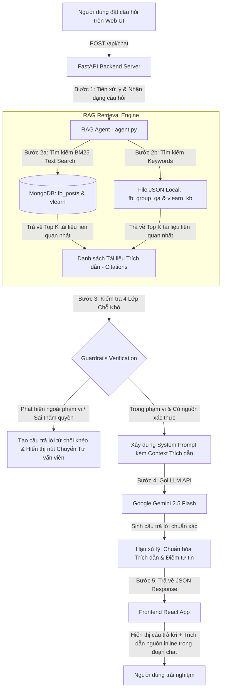

# TÀI LIỆU KIẾN TRÚC & TỔNG QUAN HỆ THỐNG
**Dự án: AI Agent QA — Khóa học AI Thực Chiến (Vingroup - VinUni)**

Tài liệu này cung cấp cái nhìn toàn diện về cấu trúc kỹ thuật, công cụ sử dụng, luồng dữ liệu (Data Flow & RAG Architecture), các chức năng cốt lõi và phương pháp quản lý, lưu trữ dữ liệu trong dự án.

---

> [!IMPORTANT]
> **ĐIỂM RA QUYẾT ĐỊNH CỦA AI TRONG SẢN PHẨM (AI DECISION MAKING):**
> **"AI quyết định câu hỏi của học viên thuộc chuyên môn có thể giải đáp chính xác từ nguồn sự thật nội bộ (Knowledge Base) hay là vấn đề ngoài phạm vi cần kích hoạt bộ lọc từ chối và chuyển cho tư vấn viên — dùng `gemini-2.5-flash` (và `gpt-4o-mini`)."**
>
> * **Bài toán**: Ngăn chặn AI sinh lời bịa đặt (Hallucination) hoặc trả lời sai thẩm quyền các vấn đề ngoài khóa học AI Thực Chiến Vingroup - VinUni.
> * **Cách model thực hiện**: Mô hình hoạt động như bộ điều hướng (Agentic Router): (1) Phân tích ngữ cảnh để quyết định gọi tool tra cứu sự thật (`search_knowledge_base`) cho câu hỏi tuyển sinh/kỹ thuật/CSVC; (2) Quyết định kích hoạt từ chối an toàn (Graceful Refusal) và hiển thị nút chuyển tiếp cho TA/Tư vấn viên khi gặp câu hỏi ngoài lĩnh vực.

---

## 1. DỰ ÁN CÓ NHỮNG TOOL / CÔNG NGHỆ NÀO? (TECHNOLOGY STACK & TOOLS)

Hệ thống được xây dựng theo mô hình **Hiện đại (Modern Full-stack AI Application)**, tích hợp các công cụ và thư viện chuyên sâu sau:

### 1.1. Backend & AI Engine (`codebase/`)
- **FastAPI (`main.py`)**: Framework Python hiệu năng cao làm API Server, phục vụ REST API cho chat (`/api/chat`), kiểm tra sức khỏe (`/api/health`) và phục vụ các file tài liệu tĩnh (`/api/docs`).
- **Google Gemini API (`google-genai` / `gemini-2.5-flash`)**: Mô hình Ngôn ngữ Lớn (LLM) trung tâm xử lý suy luận, trả lời câu hỏi và tuân thủ các quy tắc an toàn (Guardrails).
- **Hybrid RAG Engine (`agent.py`)**:
  - **BM25 / Keyword Retrieval**: Thuật toán tìm kiếm văn bản full-text nhạy bén, giúp truy xuất nhanh các từ khóa đặc thù từ câu hỏi của người dùng.
  - **MongoDB Vector & Text Search**: Kết hợp tra cứu theo ngữ nghĩa và từ khóa trên các collections trong MongoDB.
- **Guardrails System**: Cơ chế kiểm tra 4 lớp chỗ khó (4-Layer Taxonomy) để ngăn chặn AI trả lời sai thẩm quyền hoặc bịa thông tin (Hallucination).

### 1.2. Frontend Web Application (`codebase/frontend/`)
- **React 18 & Vite**: Framework frontend tốc độ cao, hỗ trợ Hot Module Replacement (HMR) và tối ưu hóa gói giao diện.
- **Vanilla CSS (`index.css`)**: Thiết kế giao diện cao cấp theo phong cách Glassmorphism, độ tương phản tốt, hỗ trợ bố cục 2 cột hiện đại.
- **Lucide Icons (`lucide-react`)**: Bộ biểu tượng vector chuyên nghiệp cho giao diện.

### 1.3. Bộ Công Cụ Dữ Liệu & Đánh Giá (Data & Evaluation Tools)
- **Database Seeder (`seed_mongo.py`)**: Công cụ tự động hóa chuẩn hóa dữ liệu từ các file JSON trong `codebase/data/` và nạp vào cơ sở dữ liệu MongoDB, tạo chỉ mục tìm kiếm.
- **Facebook Group Scraper (`scraper_fb.py`)**: Công cụ thu thập dữ liệu hỏi đáp thực tế từ cộng đồng Facebook Group QA.
- **Automated Golden Set Evaluator (`eval/run_golden_set.py`)**: Bộ kiểm thử tự động với bộ câu hỏi chuẩn (Golden Set) để đánh giá độ chính xác của RAG và tỷ lệ tuân thủ Guardrails (đạt 100% Pass Rate).

---

## 2. LUỒNG DỮ LIỆU CHẠY NHƯ THẾ NÀO? (DATA FLOW & ARCHITECTURE)

Hệ thống hoạt động theo luồng truy xuất tăng cường sinh ngôn ngữ (**Retrieval-Augmented Generation - RAG**) kết hợp bảo tra cứu nguồn sự thật:



### Các Bước Chi Tiết Trong Luồng Xử Lý:
1. **Tiếp nhận Yêu cầu**: Người dùng nhập câu hỏi hoặc chọn kịch bản Demo từ giao diện React. Request được gửi qua endpoint `POST /api/chat`.
2. **Truy xuất Tri thức (Hybrid Retrieval)**:
   - Agent truy vấn cơ sở dữ liệu MongoDB (`fb_posts`, `vlearn`) và kho lưu trữ bộ nhớ (Memory KB từ `@codebase/data`).
   - Thuật toán kết hợp điểm số BM25 và từ khóa để chọn ra **Top 3 - 5 tài liệu chuẩn xác nhất** có liên quan đến Tuyển sinh, Cơ sở vật chất VinUni hoặc Kỹ thuật.
3. **Kiểm tra Rủi ro (Guardrails Evaluation)**:
   - **Lớp 1 (Nguồn sự thật - Ground Truth)**: Kiểm tra xem có tài liệu trong hệ thống hỗ trợ câu trả lời hay không.
   - **Lớp 2 (Mơ hồ - Ambiguity)**: Phát hiện câu hỏi thiếu ngữ cảnh để hỏi lại.
   - **Lớp 3 (Thẩm quyền - Out of Scope)**: Nếu hỏi các vấn đề ngoài phạm vi (ví dụ: *giá xe VinFast, chứng khoán...*), hệ thống kích hoạt cờ `layer3_authority` và từ chối an toàn.
   - **Lớp 4 (Rủi ro chuyên môn - Domain Safety)**: Đảm bảo không vi phạm các quy định bảo mật hoặc sai lệch thông tin quan trọng.
4. **Sinh Ngôn ngữ (LLM Generation)**:
   - Các trích dẫn đã được lọc được đưa vào System Prompt của **Gemini 2.5 Flash**. Mô hình sinh lời giải đáp mạch lạc, thân thiện theo đúng giọng điệu trợ lý Vingroup/VinUni.
5. **Hiển thị Trực tiếp trên Giao diện (Inline UI Rendering)**:
   - Backend trả về `answer`, `citations` (danh sách nguồn kèm tiêu đề, URL, nội dung) và `confidence_score`.
   - Frontend hiển thị câu trả lời của AI và **nhúng trực tiếp khung Nguồn tài liệu tham khảo ngay bên trong tin nhắn chat** (`inline-chat-citations`), cho phép người dùng đọc ngay trích đoạn hoặc nhấp link mở tài liệu.

---

## 3. MÌNH CÓ NHỮNG CHỨC NĂNG NÀO? (KEY FEATURES & FUNCTIONALITIES)

Dự án sở hữu 4 nhóm chức năng cốt lõi:

### 3.1. Chức năng Tư vấn Khóa học AI Thực Chiến (Vingroup - VinUni)
- **Vai trò như một Bộ phận Tuyển sinh (Admissions & Student Support Persona)**: AI đóng vai trò như chuyên viên tuyển sinh chuyên nghiệp — **chỉ giải đáp thông tin về khóa học và những thông tin đã được công bố công khai (publicly released)**, tuyệt đối không tiết lộ thông tin nội bộ bảo mật hay vượt thẩm quyền.
- **Đối tượng phục vụ trọng tâm (Core Target Audience)**:
  1. *Học sinh/Học viên mới đang tìm hiểu chương trình*: Hỗ trợ tra cứu nhanh điều kiện tuyển sinh, lộ trình đào tạo 3 tháng, chính sách học bổng 100% từ Vingroup để truyền cảm hứng và giúp ứng viên tự tin ứng tuyển.
  2. *Học viên mới vào học cần thông tin về trường*: Hỗ trợ tận tình và chính xác các thông tin cơ sở vật chất tại trường (VinUni / Tòa Vin) như Căng tin tầng 1, Phòng tự học (07:30 - 21:00), mạng Wifi miễn phí, bãi gửi xe để tân học viên dễ dàng hòa nhập môi trường học tập.
- **Tư vấn Tuyển sinh & Lộ trình 3 tháng**: Giải đáp chi tiết về đối tượng tuyển sinh, yêu cầu đầu vào (lập trình Python, tư duy logic), học bổng tài trợ 100% học phí từ Vingroup.
- **Tư vấn Cơ sở vật chất & Tiện ích tại trường (VinUni / Tòa Vin)**: Cung cấp chính xác giờ mở cửa, quy chế sử dụng **Căng tin VinUni (tầng 1)**, **Phòng tự học (07:30 - 21:00)**, **Mạng Wifi miễn phí (VinUni-Guest)** và quyền lợi **Bãi gửi xe miễn phí** cho học viên.
- **Giải đáp Thông tin Sự kiện & Học viên (Facebook Group QA & VLearn)**: Cung cấp các thông tin công khai về lịch học, thông báo sự kiện, và các chính sách hỗ trợ học viên đã được BTC công bố.

### 3.2. Chức năng Kiểm soát An toàn AI (4 Lớp Chỗ Khó — Guardrails Taxonomy)
- **Chống bịa đặt thông tin (Anti-Hallucination)**: Chỉ trả lời khi có nguồn dữ liệu đối chứng trong hệ thống.
- **Từ chối thông minh & Chuyển tiếp (Graceful Refusal & Handover)**: Khi người dùng hỏi các vấn đề ngoài khóa học, AI tự động giải thích phạm vi hoạt động và hiển thị nút hành động **"Chuyển cho tư vấn viên để được giải đáp đúng nhu cầu"**.
- **Đánh giá điểm tự tin (Confidence Scoring)**: Mỗi câu trả lời đều được tính toán chỉ số tự tin trên thang điểm (ví dụ: *0.95 - High Confidence*).

### 3.3. Chức năng Giao diện Tương tác Hiện đại (Modern UI/UX)
- **Bố cục 2 Cột Chuyên nghiệp**:
  - **Cột Trái (Cửa sổ Chat AI)**: Giao diện mô phỏng hộp thoại thông minh, hiển thị tin nhắn của người dùng và Agent. Nguồn trích dẫn hiển thị dạng thẻ đẹp mắt ngay bên trong bong bóng tin nhắn.
  - **Cột Phải (Lịch Trình Khóa Học & Tiện Ích)**: Danh sách các sự kiện quan trọng (Lễ Khai Giảng, Workshop Prompt Engineering, Khu vực Học tập & Tiện ích VinUni, Checkpoint Thực hành) đi kèm thời gian, địa điểm và các **nút hành động nhanh** (xem lộ trình, vào phòng Meet, mở sổ tay cơ sở vật chất).
- **Kịch bản Demo Kiểm thử (4 Demo Pills)**:
  - `1. Tuyển sinh & Lộ trình`: Hỏi về thời lượng khóa học và yêu cầu đầu vào.
  - `2. Học bổng & Học phí`: Hỏi về học phí và chính sách học bổng 100% từ Vingroup.
  - `3. Ngoài phạm vi`: Hỏi về giá lăn bánh xe VinFast VF8 (AI từ chối nhẹ nhàng đúng chuẩn nghiệp vụ).
  - `4. Cơ sở vật chất`: Hỏi về giờ mở cửa Căng tin VinUni và khu vực sinh hoạt cá nhân của học viên.

### 3.4. Chức năng Đăng nhập bằng Tài khoản Google Cá nhân & Quản lý Người dùng MongoDB (Google OAuth & Users Collection)
- **Cổng xác thực Google bắt buộc**: Người dùng bắt buộc phải đăng nhập bằng **Tài khoản Google cá nhân (Gmail)** thì mới vào được giao diện chính của con chat.
- **Tích hợp xác thực 2 chế độ (Dual-mode Google Authentication)**:
  1. *Chế độ 1: Đăng nhập Google thật (Real OAuth 2.0)*: Sử dụng thư viện `@react-oauth/google` và `jwt-decode` tích hợp trực tiếp **Google Identity Services SDK**. Khi người dùng bấm nút đăng nhập chính chủ từ Google, hệ thống mở cửa sổ xác thực thật, giải mã JWT token để lấy **Email thật, Họ tên thật, Ảnh đại diện Google thật** và Google ID (`sub`).
  2. *Chế độ 2: Đăng nhập nhanh (Mô phỏng Gmail)*: Hỗ trợ chọn nhanh các tài khoản mẫu cho ứng viên & tân sinh viên hoặc nhập địa chỉ Gmail cá nhân tùy chọn trong trường hợp kiểm thử offline.
- **Quản lý Dữ liệu Người dùng trên MongoDB (`users` collection)**:
  - Khi người dùng đăng nhập, Backend FastAPI (`POST /api/auth/google`) tự động kiểm tra, lưu mới hoặc cập nhật hồ sơ người dùng vào bảng `users` trong MongoDB (`email`, `name`, `picture`, `google_id`, `last_login`).
  - Dữ liệu người dùng được lưu trữ bền vững trong `localStorage` để duy trì trạng thái đăng nhập và hiển thị huy hiệu người dùng trên Header (kèm nút **Đăng xuất**).

### 3.5. Chức năng Tự động hóa Dữ liệu & Kiểm thử (Scraping & Evaluation)
- **Scraper tự động (`scraper_fb.py`)**: Thu thập các câu hỏi và câu trả lời đã được Mentor/TA xác thực trên Group Facebook khóa học.
- **Bộ kiểm thử chuẩn (`run_golden_set.py`)**: Chạy kiểm thử tự động hàng loạt câu hỏi tiêu chuẩn để đảm bảo RAG không bị suy thoái chất lượng khi nâng cấp hệ thống.
- **Bảng kiểm tra 4 kiểu tình huống khó theo Rubric (4 Scenario Types) — ĐÃ CÓ ĐỦ (≥ 2 câu/kiểu)**:
  - [x] **Kiểu 1: Câu mà thông tin KHÔNG có trong tài liệu — xem AI có bịa ra không** *(3 câu: Case #21 Hoàng Sa/Trường Sa, #22 World Cup, #23 Công thức nấu phở)* → AI từ chối ngoài phạm vi, không bịa.
  - [x] **Kiểu 2: Câu mơ hồ, thiếu ngữ cảnh — xem AI hỏi lại hay đoán bừa** *(2 câu: Case #3 Lỗi pip, #4 Bài 2 làm sao)* → AI hỏi lại để làm rõ ngữ cảnh.
  - [x] **Kiểu 3: Câu đòi thứ sản phẩm không được phép làm** *(3 câu: Case #5 Viết hộ full code CP3, #6 Xin code full CP4, #18 Viết hộ CV)* → AI từ chối viết hộ toàn bộ code, giải thích Vibe-coding rule.
  - [x] **Kiểu 4: Câu mà trả lời sai gây hậu quả thật cho người dùng (muộn deadline, sai quy chế, mất điểm)** *(4 câu: Case #1 Hạn nộp spec Batch 01, #2 Deadline khóa 2, #11 Hạn nộp spec Batch 03, #20 Khi nào nộp spec)* → AI bảo vệ sự thật, ngăn nhầm deadline khóa cũ.

### 3.5. Chức năng Phân Luồng Ngữ Cảnh & Tăng Cường Sáng Tạo (Intelligent Creativity & Source-Routing Switch)
Hệ thống tích hợp cơ chế nhận dạng ngữ cảnh để quyết định thông minh khi nào sử dụng dữ liệu chính thức và khi nào tự do sáng tạo:
- **Nhóm 1 - Sự thật chính thức của chương trình (Official Course Facts - Chuẩn xác 100% & Có Trích dẫn)**:
  - Khi hỏi về: Quy chế, học bổng 100%, học phí, lộ trình 3 tháng, yêu cầu đầu vào, cơ sở vật chất tại trường (VinUni / Tòa Vin, căng tin, phòng tự học, wifi, bãi xe), lịch trình checkpoint (CP1-CP6), deadline, rubric chấm điểm.
  - *Hành động*: BẮT BUỘC tra cứu `search_knowledge_base`, lấy chính xác dữ liệu gốc trong hệ thống và đính kèm link nguồn Markdown.
- **Nhóm 2 - Ngữ cảnh mở rộng & Tư vấn kỹ năng (Creative & General Context - Sáng tạo & Sinh động)**:
  - Khi hỏi về: Khái niệm AI/LLM/RAG/Agent/HAX/PAIR/JTBD/Vibe-coding, hướng dẫn kỹ năng lập trình (Python, debug code, tư duy giải thuật), tư vấn phương pháp học, ý tưởng đồ án, hoặc các ngữ cảnh bên ngoài bài giảng không có trong quy chế cứng.
  - *Hành động*: AI PHÁT HUY TỐI ĐA SỰ SÁNG TẠO (`temperature = 0.7`), kiến thức chuyên gia AI, đưa ra ví dụ trực quan, hướng dẫn từng bước (step-by-step reasoning), pseudocode hoặc so sánh thực tế để học viên dễ hiểu nhất mà không bị gò bó máy móc vào câu chữ trong cơ sở dữ liệu.

---

## 4. MÌNH LƯU DATA RA SAO? (DATA STORAGE & SCHEMA ARCHITECTURE)

Hệ thống áp dụng mô hình lưu trữ **2 lớp (Hybrid Storage Model)**: Lưu trữ file tĩnh (Local Static Files) và Cơ sở dữ liệu NoSQL (MongoDB).

```
d:\Lap5\Batch03-K4-AI-Product-Hackathon\
├── codebase/
│   ├── data/
│   │   ├── fb_group_qa.json    <-- Dữ liệu hỏi đáp cộng đồng Facebook Group QA
│   │   ├── vlearn_kb.json      <-- Tri thức bài giảng VLearn, Tuyển sinh & CSVC VinUni
│   │   └── raw/                <-- Log dữ liệu thô thu thập từ Scraper
│   ├── seed_mongo.py           <-- Script đồng bộ & làm sạch dữ liệu vào MongoDB
│   └── main.py / agent.py      <-- API Server & RAG Engine đọc dữ liệu
```

### 4.1. Cấu Trúc File JSON Local (`codebase/data/`)
Đây là nguồn sự thật gốc (Ground Truth Storage), được định dạng bằng JSON chuẩn UTF-8:

1. **`fb_group_qa.json`** (Hỏi đáp Facebook Group):
   - Lưu trữ các bài đăng hỏi đáp kỹ thuật và học tập giữa học viên và đội ngũ hỗ trợ.
   - **Schema mẫu**:
     ```json
     {
       "id": "fb_post_363757814515154_01",
       "post_id": "363757814515154_1001",
       "author_type": "student",
       "author_name": "Học viên ẩn danh (U0142)",
       "question": "Mọi người cho em hỏi lỗi khi chạy pip install -r requirements.txt trên Windows...",
       "category": "technical_setup",
       "verified_answer": {
         "author_type": "ta",
         "author_name": "Nguyễn Văn A (TA)",
         "content": "Lỗi này do thiếu build tools cho Python trên Windows...",
         "source_url": "https://www.facebook.com/groups/1450219003271674/..."
       }
     }
     ```

2. **`vlearn_kb.json`** (Tri thức Chương trình, Tuyển sinh & Cơ sở vật chất):
   - Lưu trữ thông tin chính thống về lộ trình khóa học AI Thực Chiến, quy chế học viên, thông tin căng tin và cơ sở vật chất VinUni.
   - **Schema mẫu**:
     ```json
     {
       "id": "campus_facilities_logistics",
       "source_id": "CAMPUS-INFO-02",
       "title": "Sổ tay Học viên — Cơ sở vật chất, Căng tin & Tiện ích tại trường (VinUni / Tòa Vin)",
       "category": "campus_logistics",
       "content": "Học viên Khóa AI Thực Chiến được tham gia học tập trực tiếp tại Tòa VinUni...",
       "source_url": "https://www.facebook.com/groups/1450219003271674/"
     }
     ```

### 4.2. Cấu Trúc Cơ Sở Dữ Liệu MongoDB (`ai_hackathon_kb`)
Hệ thống kết nối tới instance MongoDB (`mongodb://localhost:27017`) với 3 collections chính:
- **`fb_posts`**: Lưu toàn bộ các câu hỏi QA từ Facebook.
  - **Chỉ mục (Indexes)**: Text Index trên trường `question` và `verified_answer.content` để hỗ trợ tra cứu toàn văn siêu tốc.
- **`vlearn`**: Lưu các bản ghi kiến thức, bài giảng và thông tin tuyển sinh/cơ sở vật chất.
  - **Chỉ mục (Indexes)**: Text Index trên `title` và `content`.
- **`handbooks`**: Lưu các sổ tay hoặc tài liệu tham khảo dạng tài liệu chính thức (`tham-khao/`).

### 4.3. Cơ Chế Làm Sạch & Đồng Bộ (Sanitization & Seeding Workflow)
- Script **`python codebase/seed_mongo.py`** chịu trách nhiệm đọc các file JSON trong `codebase/data/` và đồng bộ hóa (Bulk Write / Upsert) vào MongoDB.
- Trong quá trình seed, hệ thống **tự động xóa bỏ các tài liệu bị nhiễu** (như log chat, transcript thô, tài liệu bài tập không liên quan) ra khỏi DB, đảm bảo AI Agent chỉ truy xuất từ nguồn tri thức tuyển sinh, cơ sở vật chất và hỏi đáp kỹ thuật chính thống.

---

## 5. TÓM TẮT THAO TÁC VẬN HÀNH DỰ ÁN (OPERATIONAL COMMANDS)

| Mục đích | Lệnh thực hiện | Thư mục chạy (CWD) |
| :--- | :--- | :--- |
| **Nạp dữ liệu vào MongoDB** | `python codebase/seed_mongo.py` | `d:\Lap5\Batch03-K4-AI-Product-Hackathon` |
| **Chạy Backend Server** | `python main.py` *(hoặc `uvicorn main:app --reload`)* | `codebase/` |
| **Chạy Dev Server Frontend** | `npm run dev` | `codebase/frontend/` |
| **Build Giao diện Production** | `npm run build` | `codebase/frontend/` |
| **Chạy Đánh giá Golden Set** | `python eval/run_golden_set.py` | `d:\Lap5\Batch03-K4-AI-Product-Hackathon` |

---
*Tài liệu được cập nhật tự động bởi AI Agent — Hệ thống hỗ trợ QA Khóa AI Thực Chiến (Vingroup - VinUni).*
